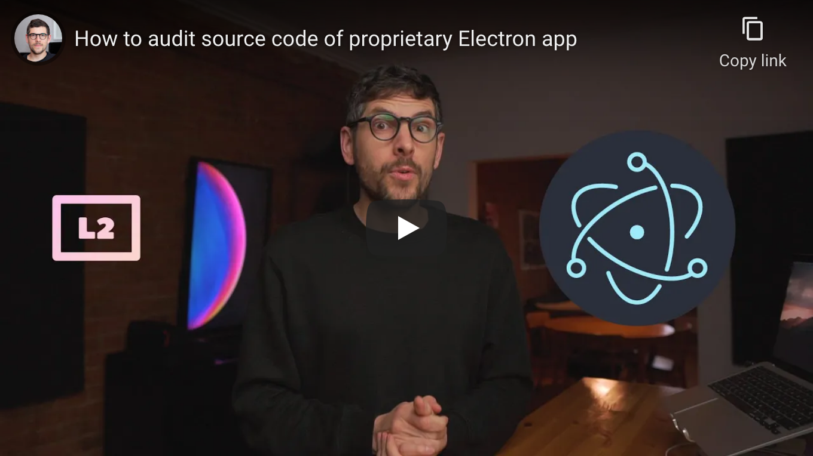

<!--
Title: How to audit source code of proprietary Electron app
Description: Learn how to audit source code of proprietary Electron app.
Author: Sun Knudsen <https://github.com/sunknudsen>
Contributors: Sun Knudsen <https://github.com/sunknudsen>
Reviewers:
Publication date: 2021-12-03T19:50:28.298Z
Listed: true
-->

# How to audit source code of proprietary Electron app

[](https://www.youtube.com/watch?v=s4S7qgCkVCc "How to audit source code of proprietary Electron app")

## Requirements

- Computer running macOS Big Sur or Monterey or disposable [Tails USB flash drive or SD card](../how-to-install-tails-on-usb-flash-drive-or-sd-card-on-macos)

## Caveats

- When copy/pasting commands that start with `$`, strip out `$` as this character is not part of the command

## macOS guide

### Step 1: install [Homebrew](https://brew.sh/)

```console
$ /bin/bash -c "$(curl -fsSL https://raw.githubusercontent.com/Homebrew/install/master/install.sh)"

$ uname -m | grep arm64 && echo 'export PATH=$PATH:/opt/homebrew/bin' >> ~/.zshrc && source ~/.zshrc
```

### Step 2: disable Homebrew analytics

```shell
brew analytics off
```

### Step 3: install dependencies

```shell
brew install node tree
```

### Step 4: extract source code

> Heads-up: replace `QR\ Bridge.app` with Electron app one wishes to audit.

```console
$ npx asar extract /Applications/QR\ Bridge.app/Contents/Resources/app.asar ~/Desktop/source
npx: installed 17 in 6.041s
```

### Step 5 (optional): list files

```console
$ tree ~/Desktop/source -I node_modules
/Users/sunknudsen/Desktop/source
├── LICENSE
├── README.md
├── app
│   ├── confirmation.wav
│   ├── index.html
│   ├── preload.js
│   ├── renderer.js
│   └── style.css
├── icon.ai
├── main.js
├── package.json
└── qr-bridge.code-workspace

1 directory, 11 files
```

### Step 6: audit app

> Heads-up: `code` is a command line utility that opens file or folder in [Visual Studio Code](https://code.visualstudio.com/).

> Heads-up: **please respect license**… being able to audit app does not mean app (including its source code) should be considered public domain.

```shell
code ~/Desktop/source
```

### Step 7: check if app calls home

Use application-layer firewall such as [Little Snitch](https://www.obdev.at/products/littlesnitch/index.html) or [Lulu](https://objective-see.com/products/lulu.html).

👍

## Linux guide

### Step 1: boot to Tails and set admin password (required to run commands using `sudo`)

> Heads-up: if keyboard layout of computer isn’t “English (US)”, set “Keyboard Layout”.

Click “+” under “Additional Settings”, then “Administration Password”, set password, click “Add” and finally “Start Tails”.

### Step 2: import [Node.js](https://nodejs.org/en/)’s PGP public key

```shell
torsocks curl -fsSL https://deb.nodesource.com/gpgkey/nodesource.gpg.key | gpg --dearmor | sudo tee /usr/share/keyrings/nodesource.gpg > /dev/null
```

### Step 3: enable Node.js’s repository

> Heads-up: run `cat /etc/issue` to find Debian version.

#### Debian 10 (buster)

```console
$ echo -e "deb [signed-by=/usr/share/keyrings/nodesource.gpg] tor+https://deb.nodesource.com/node_16.x buster main\ndeb-src [signed-by=/usr/share/keyrings/nodesource.gpg] tor+https://deb.nodesource.com/node_16.x buster main" | sudo tee /etc/apt/sources.list.d/nodesource.list > /dev/null

$ sudo apt update
```

#### Debian 11 (bullseye)

```console
$ echo -e "deb [signed-by=/usr/share/keyrings/nodesource.gpg] tor+https://deb.nodesource.com/node_16.x bullseye main\ndeb-src [signed-by=/usr/share/keyrings/nodesource.gpg] tor+https://deb.nodesource.com/node_16.x bullseye main" | sudo tee /etc/apt/sources.list.d/nodesource.list > /dev/null

$ sudo apt update
```

### Step 4: find Node.js version

```console
$ sudo apt-cache madison nodejs
    nodejs | 16.13.1-deb-1nodesource1 | tor+https://deb.nodesource.com/node_16.x buster/main amd64 Packages
    nodejs | 12.22.7~dfsg-2 | tor+https://cdn-fastly.deb.debian.org/debian sid/main amd64 Packages
    nodejs | 12.22.5~dfsg-2~11u1 | tor+https://cdn-fastly.deb.debian.org/debian bullseye/main amd64 Packages
    nodejs | 10.24.0~dfsg-1~deb10u1 | tor+https://cdn-fastly.deb.debian.org/debian buster/main amd64 Packages
    nodejs | 10.24.0~dfsg-1~deb10u1 | tor+https://cdn-fastly.deb.debian.org/debian-security buster/updates/main amd64 Packages
```

### Step 5: install dependencies

> Heads-up: replace `nodejs=16.13.1-deb-1nodesource1` with version found at [step 4](#step-4-find-nodejs-version).

```shell
sudo apt install -y nodejs=16.13.1-deb-1nodesource1 tree
```

### Step 6: extract “resources” directory from AppImage

> Heads-up: replace `qr-bridge.AppImage` with Electron app one wishes to audit.

```console
$ ./qr-bridge.AppImage --appimage-extract resources
squashfs-root/resources
squashfs-root/resources/app-update.yml
squashfs-root/resources/app.asar
```

### Step 7: extract source code

> Heads-up: ignore torsocks warnings (if present).

```console
$ torsocks npx asar extract squashfs-root/resources/app.asar ~/Desktop/source
Need to install the following packages:
  asar
Ok to proceed? (y) y
```

### Step 8 (optional): list files

```console
$ tree ~/Desktop/source -I node_modules
/home/amnesia/Desktop/source
├── app
│   ├── confirmation.wav
│   ├── index.html
│   ├── preload.js
│   ├── renderer.js
│   └── style.css
├── icon.ai
├── LICENSE
├── main.js
├── package.json
├── qr-bridge.code-workspace
└── README.md

1 directory, 11 files
```

### Step 9: audit app

> Heads-up: **please respect license**… being able to audit app does not mean app (including its source code) should be considered public domain.

Audit source code using “Text Editor”.

👍
