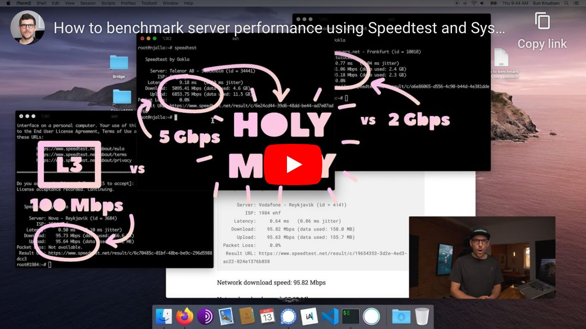

<!--
Title: How to benchmark server performance using Speedtest and SysBench
Description: Learn how to benchmark server performance using Speedtest and SysBench.
Author: Sun Knudsen <https://github.com/sunknudsen>
Contributors: Sun Knudsen <https://github.com/sunknudsen>
Reviewers:
Publication date: 2020-07-31T12:39:56.670Z
Listed: true
Pinned:
-->

# How to benchmark server performance using Speedtest and SysBench

[](https://www.youtube.com/watch?v=zcq2iZUcQQY "How to benchmark server performance using Speedtest and SysBench")

> Heads-up: Speedtest is known for tracking users therefore it is recommended to run the following benchmark tests on staging servers.

## Requirements

- Virtual private server (VPS) or dedicated server running Debian 10 (buster) or Debian 11 (bullseye)

## Caveats

- When copy/pasting commands that start with `$`, strip out `$` as this character is not part of the command
- When copy/pasting commands that start with `cat << "EOF"`, select all lines at once (from `cat << "EOF"` to `EOF` inclusively) as they are part of the same (single) command

## Setup guide

### Step 1: check if [backports](https://backports.debian.org/) repository is enabled

```shell
cat /etc/apt/sources.list | grep "backports"
```

### Step 2: enable backports repository (required if previous command returned nothing)

> Heads-up: run `cat /etc/debian_version` to find Debian version.

#### Debian 10 (buster)

```shell
cat << "EOF" >> /etc/apt/sources.list
deb http://deb.debian.org/debian buster-backports main
EOF
apt update
```

#### Debian 11 (bullseye)

```shell
cat << "EOF" >> /etc/apt/sources.list
deb http://deb.debian.org/debian bullseye-backports main
EOF
apt update
```

### Step 3: install apt-transport-https, cURL and GnuPG

```shell
apt update
apt install -y apt-transport-https curl gnupg2
```

### Step 4: import [Speedtest](https://www.speedtest.net/)’s PGP public key

```shell
curl -fsSL https://packagecloud.io/ookla/speedtest-cli/gpgkey | gpg --dearmor > /usr/share/keyrings/speedtest-cli.gpg
```

### Step 5: enable Speedtest’s repository

> Heads-up: run `cat /etc/debian_version` to find Debian version.

#### Debian 10 (buster)

```shell
echo -e "deb [signed-by=/usr/share/keyrings/speedtest-cli.gpg] https://packagecloud.io/ookla/speedtest-cli/debian/ buster main\ndeb-src [signed-by=/usr/share/keyrings/speedtest-cli.gpg] https://packagecloud.io/ookla/speedtest-cli/debian/ buster main" > /etc/apt/sources.list.d/speedtest-cli.list
apt update
```

#### Debian 11 (bullseye)

```shell
echo -e "deb [signed-by=/usr/share/keyrings/speedtest-cli.gpg] https://packagecloud.io/ookla/speedtest-cli/debian/ bullseye main\ndeb-src [signed-by=/usr/share/keyrings/speedtest-cli.gpg] https://packagecloud.io/ookla/speedtest-cli/debian/ bullseye main" > /etc/apt/sources.list.d/speedtest-cli.list
apt update
```

### Step 6: install Speedtest and SysBench

```shell
apt install -y speedtest sysbench
```

👍

---

## Usage guide

### Benchmark network

> Heads-up: depending on iptables or nftables firewall configuration, running following commands may be required.

#### iptables

```shell
iptables -A OUTPUT -p tcp -m tcp --dport 8080 -m state --state NEW -j ACCEPT
ip6tables -A OUTPUT -p tcp -m tcp --dport 8080 -m state --state NEW -j ACCEPT
```

#### nftables

> Heads-up: replace `firewall` if needed (see `nft list ruleset`).

```shell
nft add rule ip firewall output tcp dport http-alt accept
nft add rule ip6 firewall output tcp dport http-alt accept
```

```console
$ speedtest

   Speedtest by Ookla

     Server: Siminn - Reykjavik (id = 4818)
        ISP: 1984 ehf
    Latency:     0.56 ms   (0.04 ms jitter)
   Download:   952.13 Mbps (data used: 429.5 MB )
     Upload:   994.18 Mbps (data used: 1.6 GB )
Packet Loss:     0.0%
 Result URL: https://www.speedtest.net/result/c/541db9ff-1731-4998-b137-9d6dd959f6aa
```

Network download speed: 940.03 Mbps

Network upload speed: 941.49 Mbps

👍

### Benchmark CPU

```console
$ sysbench cpu --threads=$(nproc) run
sysbench 1.0.20 (using system LuaJIT 2.1.0-beta3)

Running the test with following options:
Number of threads: 1
Initializing random number generator from current time


Prime numbers limit: 10000

Initializing worker threads...

Threads started!

CPU speed:
    events per second:  4312.04

General statistics:
    total time:                          10.0002s
    total number of events:              43123

Latency (ms):
         min:                                    0.23
         avg:                                    0.23
         max:                                    0.64
         95th percentile:                        0.24
         sum:                                 9989.38

Threads fairness:
    events (avg/stddev):           43123.0000/0.00
    execution time (avg/stddev):   9.9894/0.00
```

CPU events per second: 4312.04

👍

### Benchmark memory

```console
$ sysbench memory --threads=$(nproc) run
sysbench 1.0.20 (using system LuaJIT 2.1.0-beta3)

Running the test with following options:
Number of threads: 1
Initializing random number generator from current time


Running memory speed test with the following options:
  block size: 1KiB
  total size: 102400MiB
  operation: write
  scope: global

Initializing worker threads...

Threads started!

Total operations: 62470941 (6246793.35 per second)

61006.78 MiB transferred (6100.38 MiB/sec)


General statistics:
    total time:                          10.0000s
    total number of events:              62470941

Latency (ms):
         min:                                    0.00
         avg:                                    0.00
         max:                                    0.23
         95th percentile:                        0.00
         sum:                                 4481.00

Threads fairness:
    events (avg/stddev):           62470941.0000/0.00
    execution time (avg/stddev):   4.4810/0.00
```

Memory speed: 6100.38 MiB/sec

👍

### Benchmark disk

> Heads-up: use `--file-block-size=16K` to simulate database or `apt install` workloads and `--file-block-size=1M` to simulate web server workload.

```console
$ sysbench fileio --file-total-size=8G prepare
sysbench 1.0.20 (using system LuaJIT 2.1.0-beta3)

128 files, 65536Kb each, 8192Mb total
Creating files for the test...
Extra file open flags: (none)
Creating file test_file.0
…
Creating file test_file.127
8589934592 bytes written in 81.95 seconds (99.96 MiB/sec).

$ sysbench fileio --file-block-size=16K --file-total-size=8G --file-test-mode=rndrw --threads=$(nproc) run
sysbench 1.0.20 (using system LuaJIT 2.1.0-beta3)

Running the test with following options:
Number of threads: 1
Initializing random number generator from current time


Extra file open flags: (none)
128 files, 64MiB each
8GiB total file size
Block size 16KiB
Number of IO requests: 0
Read/Write ratio for combined random IO test: 1.50
Periodic FSYNC enabled, calling fsync() each 100 requests.
Calling fsync() at the end of test, Enabled.
Using synchronous I/O mode
Doing random r/w test
Initializing worker threads...

Threads started!


File operations:
    reads/s:                      4042.23
    writes/s:                     2694.82
    fsyncs/s:                     8629.92

Throughput:
    read, MiB/s:                  63.16
    written, MiB/s:               42.11

General statistics:
    total time:                          10.0040s
    total number of events:              153609

Latency (ms):
         min:                                    0.00
         avg:                                    0.06
         max:                                   10.10
         95th percentile:                        0.15
         sum:                                 9963.22

Threads fairness:
    events (avg/stddev):           153609.0000/0.00
    execution time (avg/stddev):   9.9632/0.00

$ sysbench fileio --file-block-size=1M --file-total-size=8G --file-test-mode=rndrw --threads=$(nproc) run
sysbench 1.0.20 (using system LuaJIT 2.1.0-beta3)

Running the test with following options:
Number of threads: 1
Initializing random number generator from current time


Extra file open flags: (none)
128 files, 64MiB each
8GiB total file size
Block size 1MiB
Number of IO requests: 0
Read/Write ratio for combined random IO test: 1.50
Periodic FSYNC enabled, calling fsync() each 100 requests.
Calling fsync() at the end of test, Enabled.
Using synchronous I/O mode
Doing random r/w test
Initializing worker threads...

Threads started!


File operations:
    reads/s:                      63.57
    writes/s:                     42.38
    fsyncs/s:                     136.57

Throughput:
    read, MiB/s:                  63.57
    written, MiB/s:               42.38

General statistics:
    total time:                          10.3782s
    total number of events:              2390

Latency (ms):
         min:                                    0.01
         avg:                                    4.19
         max:                                  160.43
         95th percentile:                       15.00
         sum:                                10004.76

Threads fairness:
    events (avg/stddev):           2390.0000/0.00
    execution time (avg/stddev):   10.0048/0.00

$ sysbench fileio --file-total-size=8G cleanup
sysbench 1.0.20 (using system LuaJIT 2.1.0-beta3)

Removing test files...
```

Disk read throughput (16K): 63.16 MiB/s
Disk write throughput (16K): 42.11 MiB/s

Disk read throughput (1M): 63.57 MiB/s
Disk write throughput (1M): 42.38 MiB/s

👍
