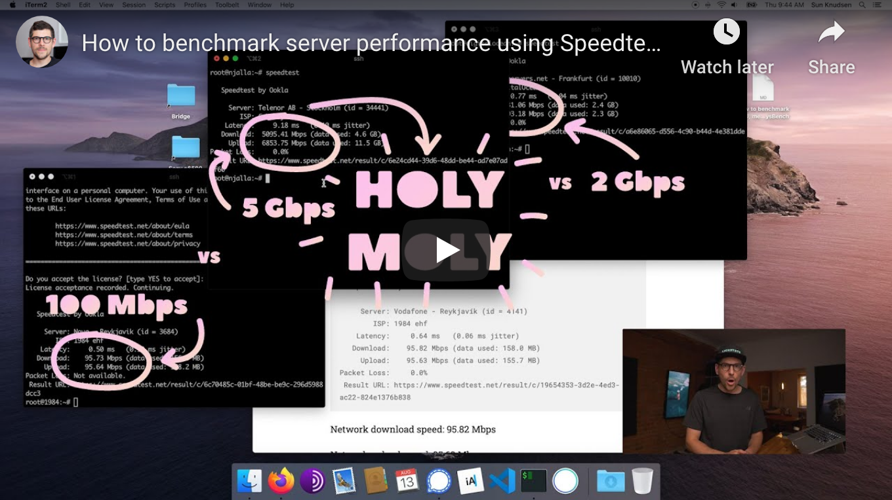

<!--
Title: How to benchmark server performance using Speedtest and SysBench
Description: Learn how to benchmark server performance using Speedtest and SysBench.
Author: Sun Knudsen <https://github.com/sunknudsen>
Contributors: Sun Knudsen <https://github.com/sunknudsen>
Reviewers:
Publication date: 2020-07-31T12:39:56.670Z
Listed: true
-->

# How to benchmark server performance using Speedtest and SysBench

[](https://www.youtube.com/watch?v=zcq2iZUcQQY "How to benchmark server performance using Speedtest and SysBench")

> Heads-up: Speedtest is known for tracking users therefore it is recommended to run the following benchmark tests on disposable servers.

## Requirements

- Virtual private server (VPS) or dedicated server running Debian 10 (buster)

## Caveats

- When copy/pasting commands that start with `$`, strip out `$` as this character is not part of the command
- When copy/pasting commands that start with `cat << "EOF"`, select all lines at once (from `cat << "EOF"` to `EOF` inclusively) as they are part of the same (single) command

## Setup guide

### Step 1: check if Backports repository is enabled

```shell
cat /etc/apt/sources.list | grep "buster-backports"
```

### Step 2: enable Backports repository (only run command if previous step returned nothing)

```shell
cat << "EOF" >> /etc/apt/sources.list
deb http://deb.debian.org/debian buster-backports main
EOF
apt update
```

### Step 3: check if GnuPG is installed

```console
$ gpg --version
-bash: gpg: command not found
```

### Step 4: install GnuPG (only run command if previous step returned `-bash: gpg: command not found`)

```shell
apt update
apt install -y gnupg2
```

### Step 5: install Common CA certificates

```shell
apt install -y ca-certificates
```

### Step 6: import [Speedtest](https://www.speedtest.net/)’s PGP public key and enable Speedtest’s repository

```console
$ apt-key adv --keyserver hkp://keyserver.ubuntu.com:80 --recv-keys 379CE192D401AB61
Executing: /tmp/apt-key-gpghome.hyKJZh5s4e/gpg.1.sh --keyserver hkp://keyserver.ubuntu.com:80 --recv-keys 379CE192D401AB61
gpg: key 379CE192D401AB61: public key "Bintray (by JFrog) <bintray@bintray.com>" imported
gpg: Total number processed: 1
gpg:               imported: 1

$ echo "deb https://ookla.bintray.com/debian buster main" | tee /etc/apt/sources.list.d/speedtest.list
deb https://ookla.bintray.com/debian buster main

$ apt update
```

### Step 7: install Speedtest and SysBench

```shell
apt install -y speedtest sysbench
```

👍

---

## Usage guide

### Benchmark network

Depending on iptables configuration, running the following commands may be required.

```shell
iptables -A OUTPUT -p tcp -m tcp --dport 8080 -m state --state NEW -j ACCEPT
ip6tables -A OUTPUT -p tcp -m tcp --dport 8080 -m state --state NEW -j ACCEPT
```

```console
$ speedtest

   Speedtest by Ookla

     Server: Vodafone - Reykjavík (id = 4141)
        ISP: 1984 ehf
    Latency:     0.64 ms   (0.06 ms jitter)
   Download:    95.82 Mbps (data used: 158.0 MB)
     Upload:    95.63 Mbps (data used: 155.7 MB)
Packet Loss:     0.0%
 Result URL: https://www.speedtest.net/result/c/19654353-3d2e-4ed3-ac22-824e1376b838
```

Network download speed: 95.82 Mbps

Network upload speed: 95.63 Mbps

### Benchmark CPU

```console
$ sysbench cpu --cpu-max-prime=20000 run
sysbench 1.0.18 (using system LuaJIT 2.1.0-beta3)

Running the test with following options:
Number of threads: 1
Initializing random number generator from current time


Prime numbers limit: 20000

Initializing worker threads...

Threads started!

CPU speed:
    events per second:   403.87

General statistics:
    total time:                          10.0012s
    total number of events:              4040

Latency (ms):
         min:                                    2.43
         avg:                                    2.47
         max:                                    4.60
         95th percentile:                        2.52
         sum:                                 9995.53

Threads fairness:
    events (avg/stddev):           4040.0000/0.00
    execution time (avg/stddev):   9.9955/0.00
```

CPU events per second: 403.87

### Benchmark memory

```console
$ sysbench memory run
sysbench 1.0.18 (using system LuaJIT 2.1.0-beta3)

Running the test with following options:
Number of threads: 1
Initializing random number generator from current time


Running memory speed test with the following options:
  block size: 1KiB
  total size: 102400MiB
  operation: write
  scope: global

Initializing worker threads...

Threads started!

Total operations: 40219144 (4020984.62 per second)

39276.51 MiB transferred (3926.74 MiB/sec)


General statistics:
    total time:                          10.0003s
    total number of events:              40219144

Latency (ms):
         min:                                    0.00
         avg:                                    0.00
         max:                                    1.84
         95th percentile:                        0.00
         sum:                                 4358.06

Threads fairness:
    events (avg/stddev):           40219144.0000/0.00
    execution time (avg/stddev):   4.3581/0.00
```

Memory speed: 3926.74 MiB/sec

### Benchmark disk

```console
$ sysbench fileio --file-total-size=8G prepare
sysbench 1.0.18 (using system LuaJIT 2.1.0-beta3)

128 files, 65536Kb each, 8192Mb total
Creating files for the test...
Extra file open flags: (none)
Creating file test_file.0
Creating file test_file.1
Creating file test_file.2
Creating file test_file.3
Creating file test_file.4
Creating file test_file.5
...
Creating file test_file.127
8589934592 bytes written in 85.92 seconds (95.34 MiB/sec).

$ sysbench fileio --file-total-size=8G --file-test-mode=rndrw --max-time=300 --max-requests=0 run
sysbench 1.0.18 (using system LuaJIT 2.1.0-beta3)

Running the test with following options:
Number of threads: 1
Initializing random number generator from current time


Extra file open flags: (none)
128 files, 64MiB each
8GiB total file size
Block size 16KiB
Number of IO requests: 0
Read/Write ratio for combined random IO test: 1.50
Periodic FSYNC enabled, calling fsync() each 100 requests.
Calling fsync() at the end of test, Enabled.
Using synchronous I/O mode
Doing random r/w test
Initializing worker threads...

Threads started!


File operations:
    reads/s:                      2727.09
    writes/s:                     1818.06
    fsyncs/s:                     5818.16

Throughput:
    read, MiB/s:                  42.61
    written, MiB/s:               28.41

General statistics:
    total time:                          300.0100s
    total number of events:              3109023

Latency (ms):
         min:                                    0.00
         avg:                                    0.10
         max:                                   11.59
         95th percentile:                        0.23
         sum:                               298089.49

Threads fairness:
    events (avg/stddev):           3109023.0000/0.00
    execution time (avg/stddev):   298.0895/0.00

$ sysbench fileio --file-total-size=8G cleanup
sysbench 1.0.18 (using system LuaJIT 2.1.0-beta3)

Removing test files..
```

Disk read throughput: 42.61 MiB/s

Disk write throughput: 28.41 MiB/s
