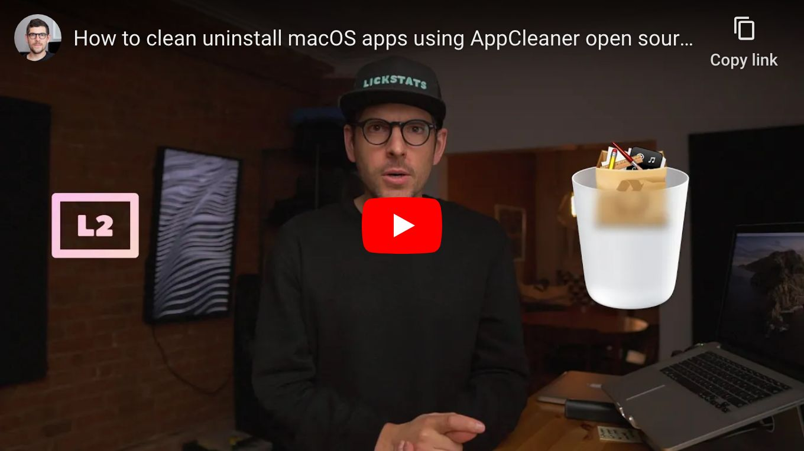

<!--
Title: How to clean uninstall macOS apps using AppCleaner open source alternative
Description: Learn how to clean uninstall macOS apps using AppCleaner open source alternative.
Author: Sun Knudsen <https://github.com/sunknudsen>
Contributors: Sun Knudsen <https://github.com/sunknudsen>, Jona Fellisch <https://github.com/jonafe>
Reviewers:
Publication date: 2020-09-21T15:50:15.415Z
Listed: true
-->

# How to clean uninstall macOS apps using AppCleaner open source alternative

[](https://www.youtube.com/watch?v=0nVOB0EE5ps "How to clean uninstall macOS apps using AppCleaner open source alternative")

## Setup guide

### Step 1: create `/usr/local/bin` directory

```shell
sudo mkdir -p /usr/local/bin
sudo chown ${USER}:staff /usr/local/bin
```

### Step 2: download [app-cleaner.sh](./app-cleaner.sh) ([PGP signature](./app-cleaner.sh.asc), [PGP public key](https://sunknudsen.com/sunknudsen.asc))

```shell
curl --fail --output /usr/local/bin/app-cleaner.sh https://raw.githubusercontent.com/sunknudsen/privacy-guides/master/how-to-clean-uninstall-macos-apps-using-appcleaner-open-source-alternative/app-cleaner.sh
chmod +x /usr/local/bin/app-cleaner.sh
```

👍

---

## Usage guide

```console
$ app-cleaner.sh /Applications/AppCleaner.app
Checking for running processes…
Finding application data…
/Applications/AppCleaner.app
/Users/sunknudsen/Library/Preferences/net.freemacsoft.AppCleaner.plist
/Users/sunknudsen/Library/Saved Application State/net.freemacsoft.AppCleaner.savedState
Move application data to trash (y or n)? y
Moving application data to trash…
Done
```

Done

👍
