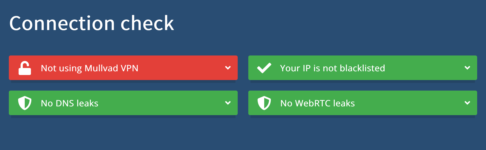

<!--
Title: How to configure Firefox for privacy and security
Description: Learn how to configure Firefox for privacy and security.
Author: Sun Knudsen <https://github.com/sunknudsen>
Contributors: Sun Knudsen <https://github.com/sunknudsen>
Reviewers:
Publication date: 2022-11-04T11:00:13.850Z
Listed: true
-->

# How to configure Firefox for privacy and security

[](https://www.youtube.com/watch?v=s-vwthG28ks "Firefox privacy and security hardening guide (2022 revised edition)")

## Caveats

- When copy/pasting commands that start with `$`, strip out `$` as this character is not part of the command

## Setup guide

### Step 1: install [Firefox](https://www.mozilla.org/en-US/firefox/new/)

Go to [https://www.mozilla.org/en-US/firefox/new/](https://www.mozilla.org/en-US/firefox/new/), download and install Firefox.

### Step 2: add [user.js](./user.js) to profile

> Heads-up: enables [Mullvad DNS over HTTPS](https://mullvad.net/en/help/dns-over-https-and-dns-over-tls/).

> Heads-up: see [arkenfox/user.js](https://github.com/arkenfox/user.js/) to explore more settings.

#### Start Firefox, paste “about:profiles” in address bar and press enter.

#### Find default profile root directory and copy to clipboard.

#### Download user.js to default profile root directory.

> Heads-up: replace `/Users/sunknudsen/Library/Application Support/Firefox/Profiles/rzrw17yo.default-release` with default profile root directory copied to clipboard.

```console
$ cd "/Users/sunknudsen/Library/Application Support/Firefox/Profiles/rzrw17yo.default-release"

$ curl --fail --remote-name https://sunknudsen.com/static/media/privacy-guides/how-to-configure-firefox-for-privacy-and-security/user.js
```

### Step 3: restart Firefox

### Step 4: install [Firefox Multi-Account Containers](https://addons.mozilla.org/en-US/firefox/addon/multi-account-containers/) and [Privacy Badger](https://addons.mozilla.org/en-US/firefox/addon/privacy-badger17/) extensions

#### Go to [https://addons.mozilla.org/en-US/firefox/addon/multi-account-containers/](https://addons.mozilla.org/en-US/firefox/addon/multi-account-containers/) and click “Add to Firefox”.

#### Go to [https://addons.mozilla.org/en-US/firefox/addon/privacy-badger17/](https://addons.mozilla.org/en-US/firefox/addon/privacy-badger17/) and click “Add to Firefox”.

> Heads-up: when asked to allow extension to run in private windows, check box and click “Okay”.

### Step 5: set default search engine to DuckDuckGo

### Step 6: configure containers (see episode)

### Step 7: check for DNS and WebRTC leaks

Go to [https://mullvad.net/en/check](https://mullvad.net/en/check).



👍

---

## Usage guide

### Temporarily disable cookie and site data deletion (useful when Firefox is restarted to install update or one wishes to reboot computer while persisting Firefox sessions)

> Heads-up: “Delete cookies and site data when Firefox is closed” will be enabled again next time Firefox starts.

Start Firefox, paste “about:preferences#privacy” in address bar and press enter.

Disable “Delete cookies and site data when Firefox is closed”.

👍

---

## Want things back the way they were before following this guide? No problem!

### Delete `user.js` and set Firefox settings as they were before following guide.

👍
