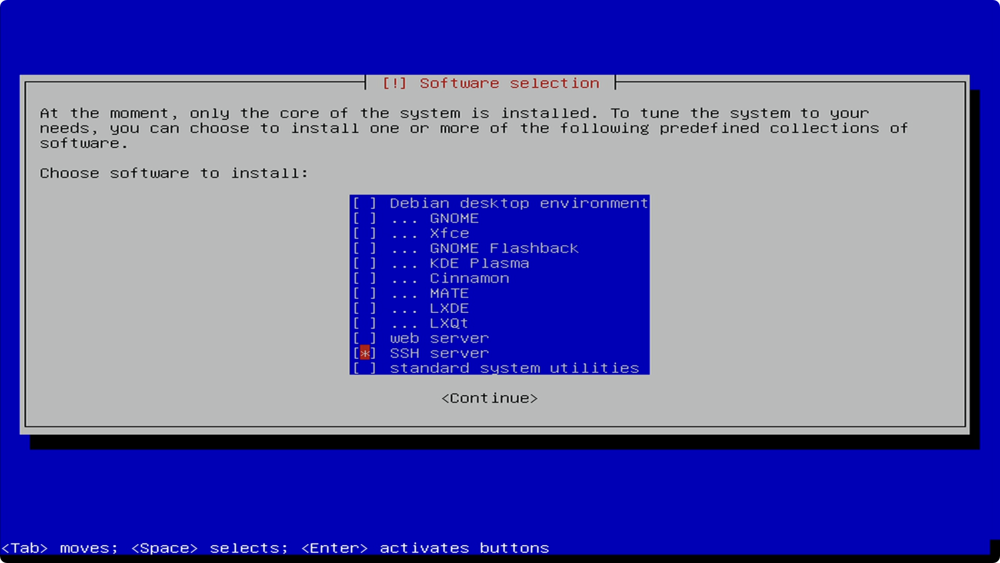

<!--
Title: How to install LUKS-encrypted Debian operating system using bootable installer
Description: Learn how to install LUKS-encrypted Debian operating system using bootable installer.
Author: Sun Knudsen <https://github.com/sunknudsen>
Contributors: Sun Knudsen <https://github.com/sunknudsen>
Reviewers:
Publication date: 2022-03-20T14:16:12.705Z
Listed: true
-->

# How to install LUKS-encrypted Debian operating system using bootable installer

## Requirements

- Debian-compatible computer with [AES instruction set](https://en.wikipedia.org/wiki/AES_instruction_set)
- Debian bootable installer (learn how to create one on Debian-based operating system [here](../how-to-create-debian-bootable-installer-on-debian-based-operating-system/README.md) or on macOS [there](../how-to-create-debian-bootable-installer-on-macos/README.md))

## Guide

### Step 1: insert bootable installer

### Step 2: disable [Compatibility Support Module (CSM)](https://en.wikipedia.org/wiki/Unified_Extensible_Firmware_Interface#CSM_booting) (also known as “Legacy Support”) and enable [Secure Boot](https://en.wikipedia.org/wiki/Unified_Extensible_Firmware_Interface#Secure_Boot)

> Heads-up: step is non-deterministic given manufacturers use different BIOS keys to boot to BIOS and menus to set [UEFI](https://en.wikipedia.org/wiki/Unified_Extensible_Firmware_Interface) features.

> Heads-up: on some computers, a “Fast Boot” feature is enabled making it hard to enter BIOS keys… disconnecting disk temporarily disables “Fast Boot”.

On HP EliteDesk 800 G2 Mini, press <kbd>F10</kbd> when HP logo appears, go to “Advanced” tab, select “Secure Boot Configuration”, press <kbd>enter</kbd>, select “Legacy Support Disable and Secure Boot Enable” under “Configure Legacy Support and Secure Boot”, press <kbd>F10</kbd>, when asked to save changes, select “Yes” and, finally, press <kbd>enter</kbd>.

### Step 3: boot to bootable installer

> Heads-up: step is non-deterministic given manufacturers use different BIOS keys and default boot orders.

On HP EliteDesk 800 G2 Mini, press <kbd>F9</kbd> when HP logo appears, select bootable installer device and, finally, press <kbd>enter</kbd>.

### Step 4: start installation

Select “Install” and press <kbd>enter</kbd>.

### Step 5: select language

Select language and press <kbd>enter</kbd>.

### Step 6: select location

Select country, territory or area and press <kbd>enter</kbd>.

### Step 7: configure keyboard

Select keymap and press <kbd>enter</kbd>.

### Step 8: configure network

#### Set hostname

Enter hostname and press <kbd>enter</kbd>.

#### Set domain

Enter domain (typically left blank) and press <kbd>enter</kbd>.

### Step 9: set up users and passwords

#### Set root password

> Heads-up: truly random 5-word passphrase or 12-character password (or longer) recommended.

Enter root password, press <kbd>enter</kbd>, re-enter password and, finally, press <kbd>enter</kbd>.

#### Set full name of new user

Enter full name of new user and press <kbd>enter</kbd>.

#### Set username of new user

Enter account username (typically left as-is) and press <kbd>enter</kbd>.

#### Set password of new user

> Heads-up: truly random 5-word passphrase or 12-character password (or longer) recommended.

Enter user password, press <kbd>enter</kbd>, re-enter password and, finally, press <kbd>enter</kbd>.

### Step 10: configure clock

Select time zone and press <kbd>enter</kbd>.

### Step 11: partition disks

#### Set partitioning method

Select “Guided - use entire disk and set up encrypted LVM” and press <kbd>enter</kbd>.

#### Set disk to partition

> Heads-up: data on selected device will be permanently destroyed.

Select device and press <kbd>enter</kbd>.

#### Set partitioning scheme

Select “All files in one partition (recommended for new users)” and press <kbd>enter</kbd>.

When asked to write changes to disk, select “Yes” and, finally, press <kbd>enter</kbd>.

#### Overwrite encrypted partition

> Heads-up: can be cancelled at the expense of slightly weaker encryption.

#### Set encryption passphrase

> Heads-up: truly random 5-word passphrase or 12-character password (or longer) recommended.

> Heads-up: can be set to user password at the expense of reduction in security.

Enter encryption passphrase, press <kbd>enter</kbd>, re-enter passphrase and, finally, press <kbd>enter</kbd>.

#### Set volume group size

Enter amount (typically left as-is) and press <kbd>enter</kbd>.

#### Delete “swap” logical volume

Select “Configure the Logical Volume Manager” and press <kbd>enter</kbd>.

When asked to write changes to disk, select “Yes” and press <kbd>enter</kbd>.

Select “Delete logical volume”, press <kbd>enter</kbd>, select “root” and, finally, press <kbd>enter</kbd>.

Select “Delete logical volume”, press <kbd>enter</kbd>, select “swap_1” and, finally, press <kbd>enter</kbd>.

Select “Create logical volume”, press <kbd>enter</kbd>, select volume group, press <kbd>enter</kbd>, enter “root” as “Logical volume name”, press <kbd>enter</kbd>, enter “Logical volume size” (typically left as-is) and, finally, press <kbd>enter</kbd>.

Select “Finish” and press <kbd>enter</kbd>.

Select “LVM” logical volume “#1”, press <kbd>enter</kbd>, select “Use as”, press <kbd>enter</kbd>, select “Ext4 journaling file system”, press <kbd>enter</kbd>, select “Mount point”, press <kbd>enter</kbd>, select “/ - the root file system”, press <kbd>enter</kbd>, select “Done setting up the partition” and, finally, press <kbd>enter</kbd>.

Select “Finish partitioning and write changes to disk” and press <kbd>enter</kbd>.

When “Do you want to return to the partitioning menu?” warning is displayed, select “No” and, finally, press <kbd>enter</kbd>.

When “Write the changes to disks” prompt is displayed, select “Yes” and, finally, press <kbd>enter</kbd>.

### Step 12: configure package manager

#### Set archive mirror country

Select Debian archive mirror country and press <kbd>enter</kbd>.

#### Set archive mirror

Select Debian archive mirror and press <kbd>enter</kbd>.

#### Set proxy

Enter HTTP proxy (typically left blank) and press <kbd>enter</kbd>.

### Step 13: configure popularity-contest

Select “No” and press <kbd>enter</kbd>.

### Step 14: select software

Using <kbd>space bar</kbd>, disable everything except “SSH server”, select “SSH server” and, finally, press <kbd>enter</kbd>.

### Step 15: finish installation

Remove bootable installer from computer and press <kbd>enter</kbd>.

👍
