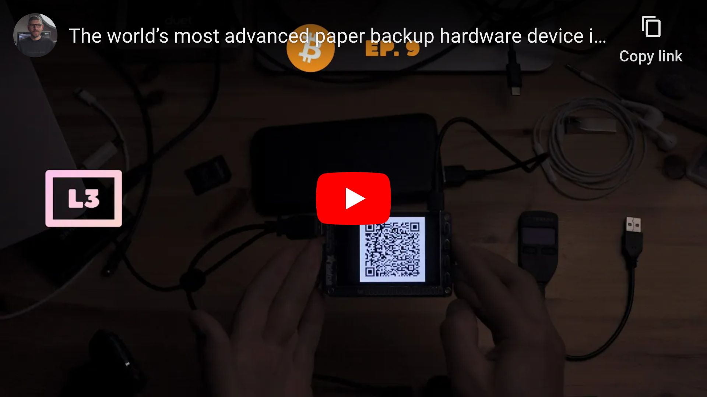
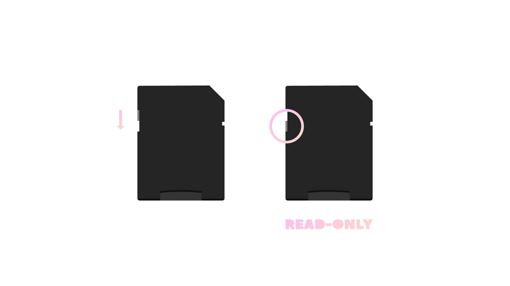

<!--
Title: How to create encrypted paper backup
Description: Learn how to create encrypted paper backup.
Author: Sun Knudsen <https://github.com/sunknudsen>
Contributors: Sun Knudsen <https://github.com/sunknudsen>, Alex Anderson <https://github.com/Serpent27>, Nico Kaiser <https://github.com/nicokaiser>, Daan Sprenkels <https://github.com/dsprenkels>
Reviewers:
Publication date: 2021-04-19T14:05:38.426Z
Listed: true
Pinned:
-->

# How to create encrypted paper backup

[](https://www.youtube.com/watch?v=2Em7jpxRrrk "The world’s most advanced paper backup hardware device is at your fingertips")

## Requirements

- [Hardened Raspberry Pi](../how-to-configure-hardened-raspberry-pi)
- [Adafruit PiTFT monitor](https://www.adafruit.com/product/2423) (optional)
- [Compatible USB webcam](https://elinux.org/RPi_USB_Webcams) (720P or 1080P, powered directly by Raspberry Pi)
- USB keyboard ([Raspberry Pi keyboard and hub](https://www.raspberrypi.org/products/raspberry-pi-keyboard-and-hub/) recommended)
- USB flash drive (faster is better)
- macOS computer

## Caveats

- When copy/pasting commands that start with `$`, strip out `$` as this character is not part of the command

## Setup guide

### Step 1: log in to Raspberry Pi

> Heads-up: replace `10.0.1.94` with IP of Raspberry Pi.

```shell
ssh -i ~/.ssh/pi pi-admin@10.0.1.94
```

### Step 2: configure console font

```console
$ sudo sed -i 's/FONTFACE=""/FONTFACE="TerminusBold"/' /etc/default/console-setup

$ sudo sed -i 's/FONTSIZE=""/FONTSIZE="10x20"/' /etc/default/console-setup
```

### Step 3: configure keyboard layout

> Heads-up: following instructions are for [Raspberry Pi keyboard](https://www.raspberrypi.org/products/raspberry-pi-keyboard-and-hub/) (US model).

> Heads-up: when asked to reboot, select “No” and press <kbd>enter</kbd>.

```shell
sudo raspi-config
```

Select “Localisation Options”, then “Keyboard”, then “Generic 105-key PC (intl.)”, then “Other”, then “English (US)”, then “English (US)”, then “The default for the keyboard layout”, then “No compose key” and, finally, select “Finish”.

### Step 4: install dependencies

```console
$ sudo apt update

$ sudo apt install -y bc expect fim git imagemagick python3-pip python3-rpi.gpio tmux zbar-tools

$ echo -e "export GPG_TTY=\"\$(tty)\"\nexport PATH=\$PATH:/home/pi/.local/bin" >> ~/.bashrc

$ source ~/.bashrc
```

### Step 5: install [ckcc](https://github.com/Coldcard/ckcc-protocol) (used to manage [COLDCARD](https://coldcard.com/) devices, see [docs](https://coldcardwallet.com/docs/cli))

```console
$ pip3 install --user ckcc-protocol[cli]

$ sudo curl --fail --output /etc/udev/rules.d/51-coinkite.rules https://raw.githubusercontent.com/Coldcard/ckcc-protocol/master/51-coinkite.rules
```

### Step 6: install [mnemonic](https://github.com/trezor/python-mnemonic) (used to create and validate BIP39 mnemonics)

```shell
pip3 install --user mnemonic
```

### Step 7: install [passphraseme](https://github.com/micahflee/passphraseme) (used to create passphrases using [EFF](https://www.eff.org/dice) wordlists)

```shell
pip3 install --user passphraseme
```

### Step 8: install [sss-cli](https://github.com/dsprenkels/sss-cli) from source (used to split and join secrets using Shamir Secret Sharing)

#### Install [Rust](https://www.rust-lang.org/)

> Heads-up: when asked for installation option, select “Proceed with installation (default)”.

```console
$ curl --proto '=https' --tlsv1.2 -sSf https://sh.rustup.rs | sh

$ source ~/.bashrc
```

#### Install sss-cli

```console
$ cargo install --git https://github.com/dsprenkels/sss-cli --branch v0.1

$ cp ~/.cargo/bin/secret-share* ~/.local/bin/
```

### Step 9: install [trezorctl](https://wiki.trezor.io/Using_trezorctl_commands_with_Trezor) (used to manage [Trezor](https://trezor.io/) devices, see [docs](https://wiki.trezor.io/Using_trezorctl_commands_with_Trezor))

```console
$ pip3 install --user attrs trezor

$ sudo curl --fail --output /etc/udev/rules.d/51-trezor.rules https://data.trezor.io/udev/51-trezor.rules
```

### Step 10: install [qrcode](https://github.com/lincolnloop/python-qrcode) (used to create QR codes)

```shell
pip3 install --user pillow qrcode
```

### Step 11: import Sun’s PGP public key (used to verify downloads below)

```console
$ curl --fail --output /home/pi/sunknudsen.asc https://sunknudsen.com/sunknudsen.asc
  % Total    % Received % Xferd  Average Speed   Time    Time     Time  Current
                                 Dload  Upload   Total   Spent    Left  Speed
100  2070  100  2070    0     0   1653      0  0:00:01  0:00:01 --:--:--  1653

$ gpg --import /home/pi/sunknudsen.asc
gpg: directory '/home/pi/.gnupg' created
gpg: keybox '/home/pi/.gnupg/pubring.kbx' created
gpg: key 8C9CA674C47CA060: 1 signature not checked due to a missing key
gpg: /home/pi/.gnupg/trustdb.gpg: trustdb created
gpg: key 8C9CA674C47CA060: public key "Sun Knudsen <hello@sunknudsen.com>" imported
gpg: Total number processed: 1
gpg:               imported: 1
gpg: no ultimately trusted keys found
```

imported: 1

👍

### Step 12: verify integrity of Sun’s PGP public key (learn how [here](../how-to-encrypt-sign-and-decrypt-messages-using-gnupg-on-macos#verify-suns-pgp-public-key-using-fingerprint))

```console
$ gpg --fingerprint hello@sunknudsen.com
pub   ed25519 2021-12-28 [C]
      E786 274B C92B 47C2 3C1C  F44B 8C9C A674 C47C A060
uid           [ unknown] Sun Knudsen <hello@sunknudsen.com>
sub   ed25519 2021-12-28 [S] [expires: 2022-12-28]
sub   cv25519 2021-12-28 [E] [expires: 2022-12-28]
sub   ed25519 2021-12-28 [A] [expires: 2022-12-28]
```

Fingerprint matches published fingerprints

👍

### Step 13: download and verify [create-bip39-mnemonic.py](./create-bip39-mnemonic.py)

```console
$ curl --fail --output /home/pi/.local/bin/create-bip39-mnemonic.py https://sunknudsen.com/static/media/privacy-guides/how-to-create-encrypted-paper-backup/create-bip39-mnemonic.py
  % Total    % Received % Xferd  Average Speed   Time    Time     Time  Current
                                 Dload  Upload   Total   Spent    Left  Speed
100   149  100   149    0     0    144      0  0:00:01  0:00:01 --:--:--   144

$ curl --fail --output /home/pi/.local/bin/create-bip39-mnemonic.py.asc https://sunknudsen.com/static/media/privacy-guides/how-to-create-encrypted-paper-backup/create-bip39-mnemonic.py.asc
  % Total    % Received % Xferd  Average Speed   Time    Time     Time  Current
                                 Dload  Upload   Total   Spent    Left  Speed
100   228  100   228    0     0    200      0  0:00:01  0:00:01 --:--:--   200

$ gpg --verify /home/pi/.local/bin/create-bip39-mnemonic.py.asc
gpg: assuming signed data in '/home/pi/.local/bin/create-bip39-mnemonic.py'
gpg: Signature made Sat 08 Jan 2022 14:33:36 EST
gpg:                using EDDSA key 9C7887E1B5FCBCE2DFED0E1C02C43AD072D57783
gpg: Good signature from "Sun Knudsen <hello@sunknudsen.com>" [unknown]
gpg: WARNING: This key is not certified with a trusted signature!
gpg:          There is no indication that the signature belongs to the owner.
Primary key fingerprint: E786 274B C92B 47C2 3C1C  F44B 8C9C A674 C47C A060
     Subkey fingerprint: 9C78 87E1 B5FC BCE2 DFED  0E1C 02C4 3AD0 72D5 7783

$ chmod 600 /home/pi/.local/bin/create-bip39-mnemonic.py
```

Good signature

👍

### Step 14: download and verify [validate-bip39-mnemonic.py](./validate-bip39-mnemonic.py)

```console
$ curl --fail --output /home/pi/.local/bin/validate-bip39-mnemonic.py https://sunknudsen.com/static/media/privacy-guides/how-to-create-encrypted-paper-backup/validate-bip39-mnemonic.py
  % Total    % Received % Xferd  Average Speed   Time    Time     Time  Current
                                 Dload  Upload   Total   Spent    Left  Speed
100   183  100   183    0     0    187      0 --:--:-- --:--:-- --:--:--   187

$ curl --fail --output /home/pi/.local/bin/validate-bip39-mnemonic.py.asc https://sunknudsen.com/static/media/privacy-guides/how-to-create-encrypted-paper-backup/validate-bip39-mnemonic.py.asc
  % Total    % Received % Xferd  Average Speed   Time    Time     Time  Current
                                 Dload  Upload   Total   Spent    Left  Speed
100   228  100   228    0     0    113      0  0:00:02  0:00:02 --:--:--   113

$ gpg --verify /home/pi/.local/bin/validate-bip39-mnemonic.py.asc
gpg: assuming signed data in '/home/pi/.local/bin/validate-bip39-mnemonic.py'
gpg: Signature made Sat 08 Jan 2022 14:33:41 EST
gpg:                using EDDSA key 9C7887E1B5FCBCE2DFED0E1C02C43AD072D57783
gpg: Good signature from "Sun Knudsen <hello@sunknudsen.com>" [unknown]
gpg: WARNING: This key is not certified with a trusted signature!
gpg:          There is no indication that the signature belongs to the owner.
Primary key fingerprint: E786 274B C92B 47C2 3C1C  F44B 8C9C A674 C47C A060
     Subkey fingerprint: 9C78 87E1 B5FC BCE2 DFED  0E1C 02C4 3AD0 72D5 7783

$ chmod 600 /home/pi/.local/bin/validate-bip39-mnemonic.py
```

Good signature

👍

### Step 15: download and verify [tmux-buttons.py](./tmux-buttons.py)

```console
$ curl --fail --output /home/pi/.local/bin/tmux-buttons.py https://sunknudsen.com/static/media/privacy-guides/how-to-create-encrypted-paper-backup/tmux-buttons.py
  % Total    % Received % Xferd  Average Speed   Time    Time     Time  Current
                                 Dload  Upload   Total   Spent    Left  Speed
100   918  100   918    0     0    897      0  0:00:01  0:00:01 --:--:--   898

$ curl --fail --output /home/pi/.local/bin/tmux-buttons.py.asc https://sunknudsen.com/static/media/privacy-guides/how-to-create-encrypted-paper-backup/tmux-buttons.py.asc
  % Total    % Received % Xferd  Average Speed   Time    Time     Time  Current
                                 Dload  Upload   Total   Spent    Left  Speed
100   228  100   228    0     0    213      0  0:00:01  0:00:01 --:--:--   213

$ gpg --verify /home/pi/.local/bin/tmux-buttons.py.asc
gpg: assuming signed data in '/home/pi/.local/bin/tmux-buttons.py'
gpg: Signature made Sat 08 Jan 2022 14:33:39 EST
gpg:                using EDDSA key 9C7887E1B5FCBCE2DFED0E1C02C43AD072D57783
gpg: Good signature from "Sun Knudsen <hello@sunknudsen.com>" [unknown]
gpg: WARNING: This key is not certified with a trusted signature!
gpg:          There is no indication that the signature belongs to the owner.
Primary key fingerprint: E786 274B C92B 47C2 3C1C  F44B 8C9C A674 C47C A060
     Subkey fingerprint: 9C78 87E1 B5FC BCE2 DFED  0E1C 02C4 3AD0 72D5 7783

$ chmod 600 /home/pi/.local/bin/tmux-buttons.py
```

Good signature

👍

### Step 16: download and verify [qr-backup.sh](./qr-backup.sh)

```console
$ curl --fail --output /home/pi/.local/bin/qr-backup.sh https://sunknudsen.com/static/media/privacy-guides/how-to-create-encrypted-paper-backup/qr-backup.sh
  % Total    % Received % Xferd  Average Speed   Time    Time     Time  Current
                                 Dload  Upload   Total   Spent    Left  Speed
100  8225  100  8225    0     0   7679      0  0:00:01  0:00:01 --:--:--  7686

$ curl --fail --output /home/pi/.local/bin/qr-backup.sh.asc https://sunknudsen.com/static/media/privacy-guides/how-to-create-encrypted-paper-backup/qr-backup.sh.asc
  % Total    % Received % Xferd  Average Speed   Time    Time     Time  Current
                                 Dload  Upload   Total   Spent    Left  Speed
100   228  100   228    0     0    259      0 --:--:-- --:--:-- --:--:--   258

$ gpg --verify /home/pi/.local/bin/qr-backup.sh.asc
gpg: assuming signed data in '/home/pi/.local/bin/qr-backup.sh'
gpg: Signature made Sat 08 Jan 2022 14:33:53 EST
gpg:                using EDDSA key 9C7887E1B5FCBCE2DFED0E1C02C43AD072D57783
gpg: Good signature from "Sun Knudsen <hello@sunknudsen.com>" [unknown]
gpg: WARNING: This key is not certified with a trusted signature!
gpg:          There is no indication that the signature belongs to the owner.
Primary key fingerprint: E786 274B C92B 47C2 3C1C  F44B 8C9C A674 C47C A060
     Subkey fingerprint: 9C78 87E1 B5FC BCE2 DFED  0E1C 02C4 3AD0 72D5 7783

$ chmod 700 /home/pi/.local/bin/qr-backup.sh
```

Good signature

👍

### Step 17: download and verify [qr-restore.sh](./qr-restore.sh)

```console
$ curl --fail --output /home/pi/.local/bin/qr-restore.sh https://sunknudsen.com/static/media/privacy-guides/how-to-create-encrypted-paper-backup/qr-restore.sh
  % Total    % Received % Xferd  Average Speed   Time    Time     Time  Current
                                 Dload  Upload   Total   Spent    Left  Speed
100  3754  100  3754    0     0   3511      0  0:00:01  0:00:01 --:--:--  3514

$ curl --fail --output /home/pi/.local/bin/qr-restore.sh.asc https://sunknudsen.com/static/media/privacy-guides/how-to-create-encrypted-paper-backup/qr-restore.sh.asc
  % Total    % Received % Xferd  Average Speed   Time    Time     Time  Current
                                 Dload  Upload   Total   Spent    Left  Speed
100   228  100   228    0     0    236      0 --:--:-- --:--:-- --:--:--   236

$ gpg --verify /home/pi/.local/bin/qr-restore.sh.asc
gpg: assuming signed data in '/home/pi/.local/bin/qr-restore.sh'
gpg: Signature made Sat 08 Jan 2022 14:33:57 EST
gpg:                using EDDSA key 9C7887E1B5FCBCE2DFED0E1C02C43AD072D57783
gpg: Good signature from "Sun Knudsen <hello@sunknudsen.com>" [unknown]
gpg: WARNING: This key is not certified with a trusted signature!
gpg:          There is no indication that the signature belongs to the owner.
Primary key fingerprint: E786 274B C92B 47C2 3C1C  F44B 8C9C A674 C47C A060
     Subkey fingerprint: 9C78 87E1 B5FC BCE2 DFED  0E1C 02C4 3AD0 72D5 7783

$ chmod 700 /home/pi/.local/bin/qr-restore.sh
```

Good signature

👍

### Step 18: download and verify [qr-clone.sh](./qr-clone.sh)

```console
$ curl --fail --output /home/pi/.local/bin/qr-clone.sh https://sunknudsen.com/static/media/privacy-guides/how-to-create-encrypted-paper-backup/qr-clone.sh
  % Total    % Received % Xferd  Average Speed   Time    Time     Time  Current
                                 Dload  Upload   Total   Spent    Left  Speed
100  1007  100  1007    0     0    930      0  0:00:01  0:00:01 --:--:--   930

$ curl --fail --output /home/pi/.local/bin/qr-clone.sh.asc https://sunknudsen.com/static/media/privacy-guides/how-to-create-encrypted-paper-backup/qr-clone.sh.asc
  % Total    % Received % Xferd  Average Speed   Time    Time     Time  Current
                                 Dload  Upload   Total   Spent    Left  Speed
100   228  100   228    0     0    230      0 --:--:-- --:--:-- --:--:--   229

$ gpg --verify /home/pi/.local/bin/qr-clone.sh.asc
gpg: assuming signed data in '/home/pi/.local/bin/qr-clone.sh'
gpg: Signature made Sat 08 Jan 2022 14:33:55 EST
gpg:                using EDDSA key 9C7887E1B5FCBCE2DFED0E1C02C43AD072D57783
gpg: Good signature from "Sun Knudsen <hello@sunknudsen.com>" [unknown]
gpg: WARNING: This key is not certified with a trusted signature!
gpg:          There is no indication that the signature belongs to the owner.
Primary key fingerprint: E786 274B C92B 47C2 3C1C  F44B 8C9C A674 C47C A060
     Subkey fingerprint: 9C78 87E1 B5FC BCE2 DFED  0E1C 02C4 3AD0 72D5 7783

$ chmod 700 /home/pi/.local/bin/qr-clone.sh
```

Good signature

👍

### Step 19: download and verify [secure-erase.sh](./secure-erase.sh)

```console
$ curl --fail --output /home/pi/.local/bin/secure-erase.sh https://sunknudsen.com/static/media/privacy-guides/how-to-create-encrypted-paper-backup/secure-erase.sh
  % Total    % Received % Xferd  Average Speed   Time    Time     Time  Current
                                 Dload  Upload   Total   Spent    Left  Speed
100  1352  100  1352    0     0   1390      0 --:--:-- --:--:-- --:--:--  1390

$ curl --fail --output /home/pi/.local/bin/secure-erase.sh.asc https://sunknudsen.com/static/media/privacy-guides/how-to-create-encrypted-paper-backup/secure-erase.sh.asc
  % Total    % Received % Xferd  Average Speed   Time    Time     Time  Current
                                 Dload  Upload   Total   Spent    Left  Speed
100   228  100   228    0     0    257      0 --:--:-- --:--:-- --:--:--   257

$ gpg --verify /home/pi/.local/bin/secure-erase.sh.asc
gpg: assuming signed data in '/home/pi/.local/bin/secure-erase.sh'
gpg: Signature made Sat 08 Jan 2022 14:33:59 EST
gpg:                using EDDSA key 9C7887E1B5FCBCE2DFED0E1C02C43AD072D57783
gpg: Good signature from "Sun Knudsen <hello@sunknudsen.com>" [unknown]
gpg: WARNING: This key is not certified with a trusted signature!
gpg:          There is no indication that the signature belongs to the owner.
Primary key fingerprint: E786 274B C92B 47C2 3C1C  F44B 8C9C A674 C47C A060
     Subkey fingerprint: 9C78 87E1 B5FC BCE2 DFED  0E1C 02C4 3AD0 72D5 7783

$ chmod 700 /home/pi/.local/bin/secure-erase.sh
```

Good signature

👍

### Step 20: download and verify [trezor-verify-integrity.sh](./trezor-verify-integrity.sh) (used to verify integrity of Trezor devices)

```console
$ curl --fail --output /home/pi/.local/bin/trezor-verify-integrity.sh https://sunknudsen.com/static/media/privacy-guides/how-to-create-encrypted-paper-backup/trezor-verify-integrity.sh
  % Total    % Received % Xferd  Average Speed   Time    Time     Time  Current
                                 Dload  Upload   Total   Spent    Left  Speed
100  1228  100  1228    0     0   1271      0 --:--:-- --:--:-- --:--:--  1269

$ curl --fail --output /home/pi/.local/bin/trezor-verify-integrity.sh.asc https://sunknudsen.com/static/media/privacy-guides/how-to-create-encrypted-paper-backup/trezor-verify-integrity.sh.asc
  % Total    % Received % Xferd  Average Speed   Time    Time     Time  Current
                                 Dload  Upload   Total   Spent    Left  Speed
100   228  100   228    0     0    244      0 --:--:-- --:--:-- --:--:--   243

$ gpg --verify /home/pi/.local/bin/trezor-verify-integrity.sh.asc
gpg: assuming signed data in '/home/pi/.local/bin/trezor-verify-integrity.sh'
gpg: Signature made Sat 08 Jan 2022 14:34:06 EST
gpg:                using EDDSA key 9C7887E1B5FCBCE2DFED0E1C02C43AD072D57783
gpg: Good signature from "Sun Knudsen <hello@sunknudsen.com>" [unknown]
gpg: WARNING: This key is not certified with a trusted signature!
gpg:          There is no indication that the signature belongs to the owner.
Primary key fingerprint: E786 274B C92B 47C2 3C1C  F44B 8C9C A674 C47C A060
     Subkey fingerprint: 9C78 87E1 B5FC BCE2 DFED  0E1C 02C4 3AD0 72D5 7783

$ chmod 700 /home/pi/.local/bin/trezor-verify-integrity.sh
```

Good signature

👍

### Step 21: download and verify [trezor-restore.sh](./trezor-restore.sh) (used to restore Trezor devices)

```console
$ curl --fail --output /home/pi/.local/bin/trezor-restore.sh https://sunknudsen.com/static/media/privacy-guides/how-to-create-encrypted-paper-backup/trezor-restore.sh
  % Total    % Received % Xferd  Average Speed   Time    Time     Time  Current
                                 Dload  Upload   Total   Spent    Left  Speed
100  1818  100  1818    0     0   1744      0  0:00:01  0:00:01 --:--:--  1744

$ curl --fail --output /home/pi/.local/bin/trezor-restore.sh.asc https://sunknudsen.com/static/media/privacy-guides/how-to-create-encrypted-paper-backup/trezor-restore.sh.asc
  % Total    % Received % Xferd  Average Speed   Time    Time     Time  Current
                                 Dload  Upload   Total   Spent    Left  Speed
100   228  100   228    0     0    257      0 --:--:-- --:--:-- --:--:--   257

$ gpg --verify /home/pi/.local/bin/trezor-restore.sh.asc
gpg: assuming signed data in '/home/pi/.local/bin/trezor-restore.sh'
gpg: Signature made Sat 08 Jan 2022 14:34:03 EST
gpg:                using EDDSA key 9C7887E1B5FCBCE2DFED0E1C02C43AD072D57783
gpg: Good signature from "Sun Knudsen <hello@sunknudsen.com>" [unknown]
gpg: WARNING: This key is not certified with a trusted signature!
gpg:          There is no indication that the signature belongs to the owner.
Primary key fingerprint: E786 274B C92B 47C2 3C1C  F44B 8C9C A674 C47C A060
     Subkey fingerprint: 9C78 87E1 B5FC BCE2 DFED  0E1C 02C4 3AD0 72D5 7783

$ chmod 700 /home/pi/.local/bin/trezor-restore.sh
```

Good signature

👍

### Step 22: download and verify [update.sh](./update.sh)

```console
$ curl --fail --output /home/pi/.local/bin/update.sh https://sunknudsen.com/static/media/privacy-guides/how-to-create-encrypted-paper-backup/update.sh
  % Total    % Received % Xferd  Average Speed   Time    Time     Time  Current
                                 Dload  Upload   Total   Spent    Left  Speed
100  1846  100  1846    0     0   1895      0 --:--:-- --:--:-- --:--:--  1895

$ curl --fail --output /home/pi/.local/bin/update.sh.asc https://sunknudsen.com/static/media/privacy-guides/how-to-create-encrypted-paper-backup/update.sh.asc
  % Total    % Received % Xferd  Average Speed   Time    Time     Time  Current
                                 Dload  Upload   Total   Spent    Left  Speed
100   228  100   228    0     0    225      0  0:00:01  0:00:01 --:--:--   225

$ gpg --verify /home/pi/.local/bin/update.sh.asc
gpg: assuming signed data in '/home/pi/.local/bin/update.sh'
gpg: Signature made Sat 08 Jan 2022 14:34:08 EST
gpg:                using EDDSA key 9C7887E1B5FCBCE2DFED0E1C02C43AD072D57783
gpg: Good signature from "Sun Knudsen <hello@sunknudsen.com>" [unknown]
gpg: WARNING: This key is not certified with a trusted signature!
gpg:          There is no indication that the signature belongs to the owner.
Primary key fingerprint: E786 274B C92B 47C2 3C1C  F44B 8C9C A674 C47C A060
     Subkey fingerprint: 9C78 87E1 B5FC BCE2 DFED  0E1C 02C4 3AD0 72D5 7783

$ chmod 700 /home/pi/.local/bin/update.sh
```

Good signature

👍

### Step 23 (optional): install [Adafruit PiTFT monitor](https://www.adafruit.com/product/2423) drivers and disable console auto login

#### Install Adafruit PiTFT monitor drivers

> Heads-up: don’t worry about `PITFT Failed to disable unit: Unit file fbcp.service does not exist.`.

```console
$ sudo pip3 install adafruit-python-shell click

$ sudo git clone https://github.com/adafruit/Raspberry-Pi-Installer-Scripts.git /usr/local/include/Raspberry-Pi-Installer-Scripts

$ sudo python3 /usr/local/include/Raspberry-Pi-Installer-Scripts/adafruit-pitft.py --display=28c --rotation=90 --install-type=console --reboot=no
```

#### Disable console auto login

> Heads-up: when asked to reboot, select “No” and press <kbd>enter</kbd>.

```shell
sudo raspi-config
```

Select “System Options”, then “Boot / Auto Login”, then “Console” and, finally, select “Finish”.

### Step 24: make filesystem read-only

> Heads-up: shout-out to Nico Kaiser for his amazing [guide](https://gist.github.com/nicokaiser/08aa5b7b3958f171cf61549b70e8a34b) on how to configure a read-only Raspberry Pi.

#### Disable fake-hwclock and logrotate

```shell
sudo systemctl disable fake-hwclock logrotate
```

#### Link `/etc/console-setup` to `/tmp/console-setup`

```console
$ sudo rm -fr /etc/console-setup

$ sudo ln -s /tmp/console-setup /etc/console-setup
```

#### Link `/home/pi/.gnupg` to `/tmp/pi/.gnupg`

```console
$ rm -fr /home/pi/.gnupg

$ ln -s /tmp/pi/.gnupg /home/pi/.gnupg
```

#### Enable tmp.mount

```console
$ echo -e "D /tmp 1777 root root -\nD /tmp/console-setup 1700 root root -\nD /tmp/pi 1700 pi pi -\nD /tmp/pi/.gnupg 1700 pi pi -\nD /var/tmp 1777 root root -" | sudo tee /etc/tmpfiles.d/tmp.conf

$ sudo cp /usr/share/systemd/tmp.mount /etc/systemd/system/

$ sudo systemctl enable tmp.mount
```

#### Edit `/boot/cmdline.txt`

```console
$ sudo sed -i 's/fsck.repair=yes/fsck.repair=skip/' /boot/cmdline.txt

$ sudo sed -i '$ s/$/ fastboot noswap ro systemd.volatile=state/' /boot/cmdline.txt
```

#### Edit `/etc/fstab`

```console
$ sudo sed -i -e 's/vfat\s*defaults\s/vfat defaults,ro/' /etc/fstab

$ sudo sed -i -e 's/ext4\s*defaults,noatime\s/ext4 defaults,noatime,ro,noload/' /etc/fstab
```

### Step 25: disable networking and “fix” rfkill bug

```console
$ sudo systemctl disable dhcpcd networking sshd.service wpa_supplicant

$ sudo rm /etc/profile.d/wifi-check.sh
```

### Step 26: disable Wi-Fi

> Heads-up: use `cat /boot/config.txt | grep "dtoverlay=disable-wifi" && echo "Wi-Fi disabled"` to see if Wi-Fi is already disabled.

```shell
echo "dtoverlay=disable-wifi" | sudo tee -a /boot/config.txt
```

### Step 27: delete macOS hidden files (if present)

```shell
sudo rm -fr /boot/.fseventsd /boot/.DS_Store /boot/.Spotlight-V100
```

### Step 28: unplug network cable (if using ethernet) and reboot

```shell
sudo systemctl reboot
```

> WARNING: DO NOT CONNECT RASPBERRY PI TO NETWORK EVER AGAIN WITHOUT REINSTALLING RASPBERRY PI OS FIRST (DEVICE IS NOW “READ-ONLY” AND “COLD”).

### Step 29 (optional): disable auto-mount of `boot` volume (on macOS)

> Heads-up: done to prevent macOS from writing [hidden files](#step-27-delete-macos-hidden-files-if-present) to `boot` volume which would invalidate stored SHA512 hash of microSD card.

#### Enable read-only mode using switch on microSD to SD adapter



#### Insert microSD card into adapter and adapter into computer

#### Run following and eject microSD card

```shell
volume_path="/Volumes/boot"
volume_uuid=$(diskutil info "$volume_path" | awk '/Volume UUID:/ { print $3 }')
echo "UUID=$volume_uuid none msdos ro,noauto" | sudo tee -a /etc/fstab
```

### Step 30 (optional): compute SHA512 hash of microSD card and store in password manager (on macOS)

> Heads-up: run `diskutil list` to find disk ID of microSD card with “Raspberry Pi OS Lite” installed (`disk4` in the following example).

> Heads-up: replace `diskn` and `rdiskn` with disk ID of microSD card (`disk4` and `rdisk4` in the following example).

```console
$ diskutil list
/dev/disk0 (internal):
   #:                       TYPE NAME                    SIZE       IDENTIFIER
   0:      GUID_partition_scheme                         500.3 GB   disk0
   1:             Apple_APFS_ISC                         524.3 MB   disk0s1
   2:                 Apple_APFS Container disk3         494.4 GB   disk0s2
   3:        Apple_APFS_Recovery                         5.4 GB     disk0s3

/dev/disk3 (synthesized):
   #:                       TYPE NAME                    SIZE       IDENTIFIER
   0:      APFS Container Scheme -                      +494.4 GB   disk3
                                 Physical Store disk0s2
   1:                APFS Volume Macintosh HD            15.3 GB    disk3s1
   2:              APFS Snapshot com.apple.os.update-... 15.3 GB    disk3s1s1
   3:                APFS Volume Preboot                 328.4 MB   disk3s2
   4:                APFS Volume Recovery                815.1 MB   disk3s3
   5:                APFS Volume Data                    458.2 GB   disk3s5
   6:                APFS Volume VM                      3.2 GB     disk3s6

/dev/disk4 (external, physical):
   #:                       TYPE NAME                    SIZE       IDENTIFIER
   0:     FDisk_partition_scheme                        *15.9 GB    disk4
   1:             Windows_FAT_32 boot                    268.4 MB   disk4s1
   2:                      Linux                         3.1 GB     disk4s2
                    (free space)                         12.5 GB    -

$ sudo diskutil unmountDisk /dev/diskn
Unmount of all volumes on disk4 was successful

$ sudo openssl dgst -sha512 /dev/rdiskns1 /dev/rdiskns2
SHA512(/dev/rdisk4s1)= a14b7c184279a3e756eaa095b619e949320e759bf4637406e82e713aff24732691aaad5aa2377086655ef04b42fc8d7c98e338ebd049f79626923c0d16e18761
SHA512(/dev/rdisk4s2)= 5627414e630eb2fa2b080858deee80daec0470668fbfcf3965fe9c52ba0bf1e68518610ee6d4d1a1212c09d2ccbdcb80989838b00369ff5e2ca4f9d10b8ae4fb
```

👍

---

## Usage guide

### Create encrypted paper backup

```console
$ qr-backup.sh --help
Usage: qr-backup.sh [options]

Options:
  --create-bip39-mnemonic        create BIP39 mnemonic
  --validate-bip39-mnemonic      validate if secret is valid BIP39 mnemonic
  --create-passphrase            create passphrase
  --wordlist <wordlist>          wordlist (defaults to large)
  --word-count <count>           word count (defaults to 7)
  --shamir-secret-sharing        split secret using Shamir Secret Sharing
  --number-of-shares <shares>    number of shares (defaults to 5)
  --share-threshold <threshold>  shares required to access secret (defaults to 3)
  --no-qr                        disable show SHA512 hash as QR code prompt
  --label <label>                print label after short hash
  -h, --help                     display help for command

$ qr-backup.sh
Format USB flash drive (y or n)?
y
mkfs.fat 4.2 (2021-01-31)
Please type secret and press enter, then ctrl+d (again)
this is a test yo
Please type passphrase and press enter
Please type passphrase and press enter (again)
Show passphrase (y or n)?
n
Encrypting secret…
-----BEGIN PGP MESSAGE-----

jA0ECQMKkp57QW3BWCD/0kUBFlMcOcvR1PPNf+SEXrHKsNgpmAadIHyf+1SGDSLl
AidLaa1d1+V5vFQowNv/6IyN+nDe/bS+qTFdPI5PptW+rVg+Rw0=
=dWxd
-----END PGP MESSAGE-----
SHA512 hash: 0ed162fe43bedf052f5af54e0dc3861ec87b579d1b8f28d85daa93c8316546cf997cd5656a69baa41fbf65b25f1a9fe7626504d480c4103903d32536b61d715a
SHA512 short hash: 0ed162fe
Show SHA512 hash as QR code (y or n)?
n
Done
```

Done

👍

The following image is now available on USB flash drive.


### Restore encrypted paper backup

> Heads-up: use `--word-list` to split secret into word list.

```console
$ qr-restore.sh --help
Usage: qr-restore.sh [options]

Options:
  --shamir-secret-sharing        combine secret using Shamir Secret Sharing
  --share-threshold <threshold>  shares required to access secret (defaults to 3)
  --word-list                    split secret into word list
  -h, --help                     display help for command

$ qr-restore.sh
Scanning QR code…
-----BEGIN PGP MESSAGE-----

jA0ECQMKkp57QW3BWCD/0kUBFlMcOcvR1PPNf+SEXrHKsNgpmAadIHyf+1SGDSLl
AidLaa1d1+V5vFQowNv/6IyN+nDe/bS+qTFdPI5PptW+rVg+Rw0=
=dWxd
-----END PGP MESSAGE-----
SHA512 hash: 0ed162fe43bedf052f5af54e0dc3861ec87b579d1b8f28d85daa93c8316546cf997cd5656a69baa41fbf65b25f1a9fe7626504d480c4103903d32536b61d715a
SHA512 short hash: 0ed162fe
Please type passphrase and press enter
gpg: AES256.CFB encrypted data
gpg: encrypted with 1 passphrase
Show secret (y or n)?
y
Secret:
this is a test yo
Done
```

Done

👍

### Clone encrypted paper backup

```console
$ qr-clone.sh --help
Usage: qr-clone.sh [options]

Options:
  --duplicate            duplicate content
  --qr-restore-options   see `qr-restore.sh --help`
  --qr-backup-options    see `qr-backup.sh --help`
  -h, --help             display help for command

$ qr-clone.sh
Restoring…
Scanning QR code…
-----BEGIN PGP MESSAGE-----

jA0ECQMKkp57QW3BWCD/0kUBFlMcOcvR1PPNf+SEXrHKsNgpmAadIHyf+1SGDSLl
AidLaa1d1+V5vFQowNv/6IyN+nDe/bS+qTFdPI5PptW+rVg+Rw0=
=dWxd
-----END PGP MESSAGE-----
SHA512 hash: 0ed162fe43bedf052f5af54e0dc3861ec87b579d1b8f28d85daa93c8316546cf997cd5656a69baa41fbf65b25f1a9fe7626504d480c4103903d32536b61d715a
SHA512 short hash: 0ed162fe
Please type passphrase and press enter
gpg: AES256.CFB encrypted data
gpg: encrypted with 1 passphrase
Show secret (y or n)?
n
Done
Backing up…
Format USB flash drive (y or n)?
y
mkfs.fat 4.2 (2021-01-31)
Please type passphrase and press enter
Please type passphrase and press enter (again)
Show passphrase (y or n)?
n
Encrypting secret…
-----BEGIN PGP MESSAGE-----

jA0ECQMKx+JfTW34bTr/0kUBtxsz8phqCf3sSzUHqR/n2wGfZJka5hvt7vE/PQdm
rXRpJmlufEyx4t1XXIidQbQjGGm11BXHjBQwhsgMSKC++NAr/PE=
=DFgX
-----END PGP MESSAGE-----
SHA512 hash: 305ca16cbcd23f782050c2ae5b0f440f549340b9d95826df2f4259100e12d4da076468a4e167070307e26b714de1587ba4d9828dbcebfd9af2e6ee345c56bd60
SHA512 short hash: 305ca16c
Show SHA512 hash as QR code (y or n)?
n
Done
```

Done

👍

The following image is now available on USB flash drive.


### Secure erase flash drive

```console
$ secure-erase.sh --help
Usage: secure-erase.sh [options]

Options:
  --rounds <rounds>  overwrite n times (defauls to 3)
  --zero             overwrite with zeros obfuscating secure erase
  -h, --help         display help for command

$ secure-erase.sh
Secure erase USB flash drive (y or n)?
y
Overwriting with random data… (round 1 of 3)
dd: error writing '/dev/sda1': No space left on device
118+0 records in
117+0 records out
122895360 bytes (123 MB, 117 MiB) copied, 44.1437 s, 2.8 MB/s
Overwriting with random data… (round 2 of 3)
dd: error writing '/dev/sda1': No space left on device
118+0 records in
117+0 records out
122895360 bytes (123 MB, 117 MiB) copied, 48.2873 s, 2.5 MB/s
Overwriting with random data… (round 3 of 3)
dd: error writing '/dev/sda1': No space left on device
118+0 records in
117+0 records out
122895360 bytes (123 MB, 117 MiB) copied, 47.0045 s, 2.6 MB/s
Done
```

Done

👍
