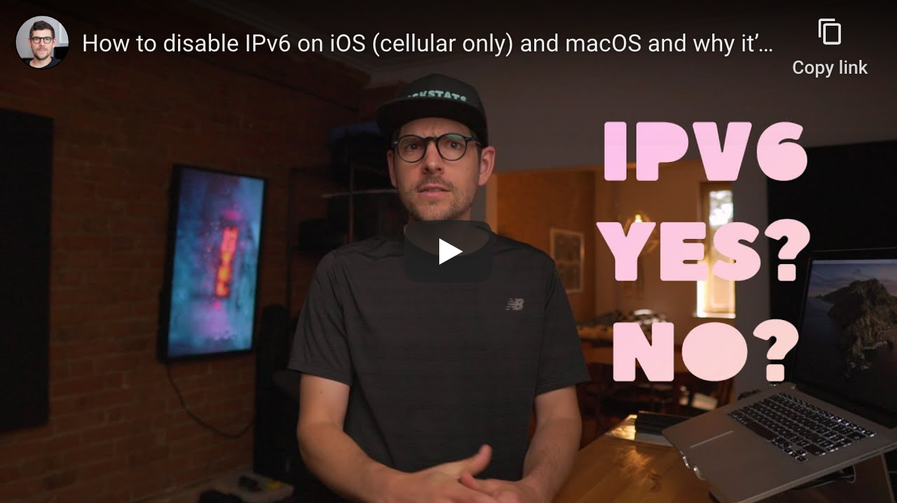

<!--
Title: How to disable IPv6 on iOS (cellular-only) and macOS and why it’s a big deal for privacy
Description: Learn how to disable IPv6 on iOS (cellular-only) and macOS and why it’s a big deal for privacy.
Author: Sun Knudsen <https://github.com/sunknudsen>
Contributors: Sun Knudsen <https://github.com/sunknudsen>
Reviewers:
Publication date: 2020-07-18T10:28:23.605Z
-->

# How to disable IPv6 on iOS (cellular-only) and macOS and why it’s a big deal for privacy

[](https://www.youtube.com/watch?v=Nzx9T7GtmT4 "How to disable IPv6 on iOS (cellular only) and macOS and why it’s a big deal for privacy - YouTube")

> Heads-up: unfortunately this guide will not work on carriers or ISPs that have migrated their networks to IPv6-only.

## iOS guide

### Step 1 (on Mac): download and open [Apple Configurator 2](https://support.apple.com/apple-configurator)

### Step 2 (on Mac): create new profile using <kbd>cmd + n</kbd>

### Step 3 (on Mac): configure "General" settings


### Step 4 (on iPhone): find APN settings

Open "Settings", then "Cellular", then "Cellular Data Network".


### Step 5 (on Mac): configure "Cellular" settings


### Step 6 (on Mac): save provisioning profile

### Step 7 (on Mac): connect iPhone to Mac

### Step 8 (on Mac): double-click on iPhone


### Step 9 (on Mac): click on "Profile" tab, then "Add Profiles...", select saved provisioning profile and click "Add"


### Step 10 (on iPhone): review profile

Open "Settings", then "Profile Downloaded" and tap "Install"


## macOS guide

### Step 1: list network interfaces

```console
$ networksetup -listallnetworkservices
An asterisk (*) denotes that a network service is disabled.
Wi-Fi
iPhone USB
Thunderbolt Ethernet
```

### Step 2: disable IPv6

> Heads-up: use network interfaces found in [step 1](#step-1-list-network-interfaces) (most computers only have `Wi-Fi` interface)

```shell
networksetup -setv6off "Wi-Fi"
networksetup -setv6off "iPhone USB"
networksetup -setv6off "Thunderbolt Ethernet"
```

---

## Want things back the way they were before following this guide? No problem!

### Step 1 (on iPhone): remove provisioning profile

Open "Settings", then "General", then "Profile", and tap provisioning profile, then "Remove Profile".


### Step 2 (on Mac): set network interfaces to automatic

```shell
networksetup -setv6automatic "Wi-Fi"
networksetup -setv6automatic "iPhone USB"
networksetup -setv6automatic "Thunderbolt Ethernet"
```
