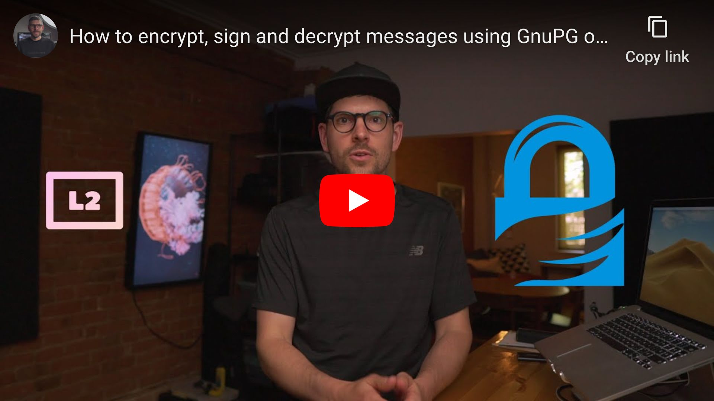

<!--
Title: How to encrypt, sign and decrypt messages using GnuPG on macOS
Description: Learn how to encrypt, sign and decrypt messages using PGP on macOS.
Author: Sun Knudsen <https://github.com/sunknudsen>
Contributors: Sun Knudsen <https://github.com/sunknudsen>, Albert <https://github.com/farwel>
Reviewers:
Publication date: 2020-06-18T00:00:00.000Z
Listed: true
Pinned:
-->

# How to encrypt, sign and decrypt messages using GnuPG on macOS

[](https://www.youtube.com/watch?v=mE8fL5Fu8x8 "How to encrypt, sign and decrypt messages using GnuPG on macOS")

> Heads-up: this is a “getting started” guide. Learn how to harden GnuPG [here](../how-to-generate-and-air-gap-pgp-private-keys-using-gnupg-tails-and-yubikey).

## Requirements

- Computer running macOS Big Sur or Monterey

## Caveats

- When copy/pasting commands that start with `$`, strip out `$` as this character is not part of the command

## Setup guide

### Step 1: install [Homebrew](https://brew.sh/)

```console
$ /bin/bash -c "$(curl -fsSL https://raw.githubusercontent.com/Homebrew/install/master/install.sh)"

$ uname -m | grep arm64 && echo 'export PATH=$PATH:/opt/homebrew/bin' >> ~/.zshrc && source ~/.zshrc
```

### Step 2: disable Homebrew analytics

```shell
brew analytics off
```

### Step 3: install [GnuPG](https://gnupg.org/)

```shell
brew install gnupg
```

### Step 4: generate PGP key pair

```console
$ gpg --full-generate-key
gpg (GnuPG) 2.3.4; Copyright (C) 2021 Free Software Foundation, Inc.
This is free software: you are free to change and redistribute it.
There is NO WARRANTY, to the extent permitted by law.

gpg: directory '/Users/sunknudsen/.gnupg' created
gpg: keybox '/Users/sunknudsen/.gnupg/pubring.kbx' created
Please select what kind of key you want:
   (1) RSA and RSA
   (2) DSA and Elgamal
   (3) DSA (sign only)
   (4) RSA (sign only)
   (9) ECC (sign and encrypt) *default*
  (10) ECC (sign only)
  (14) Existing key from card
Your selection? 9
Please select which elliptic curve you want:
   (1) Curve 25519 *default*
   (4) NIST P-384
   (6) Brainpool P-256
Your selection? 1
Please specify how long the key should be valid.
         0 = key does not expire
      <n>  = key expires in n days
      <n>w = key expires in n weeks
      <n>m = key expires in n months
      <n>y = key expires in n years
Key is valid for? (0) 0
Key does not expire at all
Is this correct? (y/N) y

GnuPG needs to construct a user ID to identify your key.

Real name: John Doe
Email address: john@example.net
Comment:
You selected this USER-ID:
    "John Doe <john@example.net>"

Change (N)ame, (C)omment, (E)mail or (O)kay/(Q)uit? O
We need to generate a lot of random bytes. It is a good idea to perform
some other action (type on the keyboard, move the mouse, utilize the
disks) during the prime generation; this gives the random number
generator a better chance to gain enough entropy.
We need to generate a lot of random bytes. It is a good idea to perform
some other action (type on the keyboard, move the mouse, utilize the
disks) during the prime generation; this gives the random number
generator a better chance to gain enough entropy.
gpg: /Users/sunknudsen/.gnupg/trustdb.gpg: trustdb created
gpg: directory '/Users/sunknudsen/.gnupg/openpgp-revocs.d' created
gpg: revocation certificate stored as '/Users/sunknudsen/.gnupg/openpgp-revocs.d/1ADDDBA409558A8E80A4DF381535F6A0BB6BD636.rev'
public and secret key created and signed.

pub   ed25519 2021-12-29 [SC]
      1ADDDBA409558A8E80A4DF381535F6A0BB6BD636
uid                      John Doe <john@example.net>
sub   cv25519 2021-12-29 [E]
```

### Step 5: back up `~/.gnupg` folder (learn how [here](../how-to-back-up-and-encrypt-data-using-rsync-and-veracrypt-on-macos))

> Heads-up: files stored in `~/.gnupg` include private keys which, if lost, results in loosing one’s cryptographic identity (safeguard backup mindfully).

👍

---

## Usage guide

### Export PGP public key

> Heads-up: replace `john@example.net` and `johndoe` with email and name from [step 4](#step-4-generate-pgp-key-pair).

```shell
gpg --armor --export john@example.net > ~/johndoe.asc
```

### Import Sun’s PGP public key using key server…

```console
$ gpg --keyserver hkps://keys.openpgp.org --recv-keys 0x8C9CA674C47CA060
gpg: key 8C9CA674C47CA060: public key "Sun Knudsen <hello@sunknudsen.com>" imported
gpg: Total number processed: 1
gpg:               imported: 1
```

imported: 1

👍

### …or using PGP public key URL

> Heads-up: verify [web of trust](#verify-suns-pgp-public-key-using-web-of-trust) to list missing keys.

```console
$ curl https://sunknudsen.com/sunknudsen.asc | gpg --import
  % Total    % Received % Xferd  Average Speed   Time    Time     Time  Current
                                 Dload  Upload   Total   Spent    Left  Speed
100  2070  100  2070    0     0   1881      0  0:00:01  0:00:01 --:--:--  1899
gpg: key 8C9CA674C47CA060: 1 signature not checked due to a missing key
gpg: key 8C9CA674C47CA060: public key "Sun Knudsen <hello@sunknudsen.com>" imported
gpg: Total number processed: 1
gpg:               imported: 1
gpg: marginals needed: 3  completes needed: 1  trust model: pgp
gpg: depth: 0  valid:   1  signed:   0  trust: 0-, 0q, 0n, 0m, 0f, 1u
```

imported: 1

👍

### Verify Sun’s PGP public key using fingerprint

```console
$ gpg --fingerprint hello@sunknudsen.com
pub   ed25519 2021-12-28 [C]
      E786 274B C92B 47C2 3C1C  F44B 8C9C A674 C47C A060
uid           [ unknown] Sun Knudsen <hello@sunknudsen.com>
sub   ed25519 2021-12-28 [S] [expires: 2022-12-28]
sub   cv25519 2021-12-28 [E] [expires: 2022-12-28]
sub   ed25519 2021-12-28 [A] [expires: 2022-12-28]
```

Open https://sunknudsen.com/, https://github.com/sunknudsen/pgp-public-key and https://www.youtube.com/sunknudsen/about and make sure above fingerprint (“E786 274B C92B 47C2 3C1C &nbsp;F44B 8C9C A674 C47C A060”) matches published fingerprints.

👍

### Verify Sun’s PGP public key using web of trust

> Heads-up: `0xC1323A377DE14C8B` is Sun’s [legacy](https://github.com/sunknudsen/pgp-public-key/tree/master/legacy) public key.

```console
$ gpg --list-signatures hello@sunknudsen.com
pub   ed25519 2021-12-28 [C]
      E786274BC92B47C23C1CF44B8C9CA674C47CA060
uid           [ unknown] Sun Knudsen <hello@sunknudsen.com>
sig 3        8C9CA674C47CA060 2021-12-28  Sun Knudsen <hello@sunknudsen.com>
sig 3        C1323A377DE14C8B 2021-12-28  [User ID not found]
sub   ed25519 2021-12-28 [S] [expires: 2022-12-28]
sig          8C9CA674C47CA060 2021-12-28  Sun Knudsen <hello@sunknudsen.com>
sub   cv25519 2021-12-28 [E] [expires: 2022-12-28]
sig          8C9CA674C47CA060 2021-12-28  Sun Knudsen <hello@sunknudsen.com>
sub   ed25519 2021-12-28 [A] [expires: 2022-12-28]
sig          8C9CA674C47CA060 2021-12-28  Sun Knudsen <hello@sunknudsen.com>
```

### Paste, encrypt and sign message (enter line break and `ctrl+d` to quit edit mode)

```console
$ gpg --encrypt --sign --armor --output ~/Desktop/encrypted.asc --recipient john@example.net --recipient hello@sunknudsen.com
gpg: F56809CDE05DB014: There is no assurance this key belongs to the named user

sub  cv25519/F56809CDE05DB014 2021-12-28 Sun Knudsen <hello@sunknudsen.com>
 Primary key fingerprint: E786 274B C92B 47C2 3C1C  F44B 8C9C A674 C47C A060
      Subkey fingerprint: F375 2162 E3A4 3F6E 2762  D50B F568 09CD E05D B014

It is NOT certain that the key belongs to the person named
in the user ID.  If you *really* know what you are doing,
you may answer the next question with yes.

Use this key anyway? (y/N) y
This is a test!
```

### Decrypt message to stdout and decode quoted-printable characters

```console
$ gpg --decrypt ~/Desktop/encrypted.asc | perl -MMIME::QuotedPrint -0777 -nle 'print decode_qp($_)'
gpg: encrypted with cv25519 key, ID F56809CDE05DB014, created 2021-12-28
      "Sun Knudsen <hello@sunknudsen.com>"
gpg: encrypted with cv25519 key, ID F9220AB453F9B6E3, created 2021-12-29
      "John Doe <john@example.net>"
gpg: Signature made Wed 29 Dec 08:24:05 2021 EST
gpg:                using EDDSA key 1ADDDBA409558A8E80A4DF381535F6A0BB6BD636
gpg: Good signature from "John Doe <john@example.net>" [ultimate]
This is a test!
```

Good signature

👍

### Clear passphrase from GnuPG cache

```shell
gpg-connect-agent reloadagent /bye
```

> Heads-up: when sending [encrypted messages](#paste-encrypt-and-sign-message-enter-line-break-and-ctrld-to-quit-edit-mode), don’t forget to include your [public key](#export-pgp-public-key).
