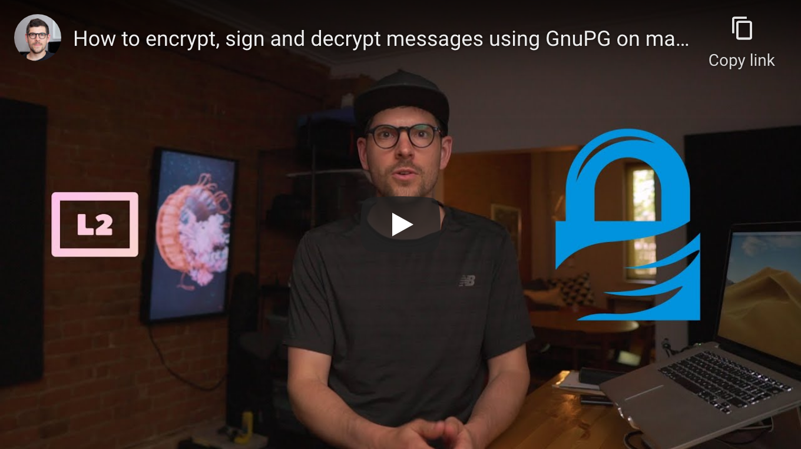

<!--
Title: How to encrypt, sign and decrypt messages using GnuPG on macOS
Description: Learn how to encrypt, sign and decrypt messages using PGP on macOS.
Author: Sun Knudsen <https://github.com/sunknudsen>
Contributors: Sun Knudsen <https://github.com/sunknudsen>, Albert <https://github.com/farwel>
Reviewers:
Publication date: 2020-06-18T00:00:00.000Z
Listed: true
-->

# How to encrypt, sign and decrypt messages using GnuPG on macOS

[](https://www.youtube.com/watch?v=mE8fL5Fu8x8 "How to encrypt, sign and decrypt messages using GnuPG on macOS")

> Heads-up: this is a “getting started” guide. Learn how to harden GnuPG [here](../how-to-generate-and-air-gap-pgp-private-keys-using-gnupg-tails-and-yubikey).

## Requirements

- Computer running macOS Catalina or Big Sur

## Caveats

- When copy/pasting commands that start with `$`, strip out `$` as this character is not part of the command

## Setup guide

### Step 1: install [Homebrew](https://brew.sh/)

```shell
/bin/bash -c "$(curl -fsSL https://raw.githubusercontent.com/Homebrew/install/master/install.sh)"
uname -m | grep arm64 && echo 'export PATH=$PATH:/opt/homebrew/bin' >> ~/.zshrc
```

### Step 2: disable Homebrew analytics

```shell
brew analytics off
```

### Step 3: install [GnuPG](https://gnupg.org/)

```shell
brew install gnupg
```

### Step 4: generate PGP key pair

```console
$ gpg --full-generate-key
gpg (GnuPG) 2.2.27; Copyright (C) 2021 Free Software Foundation, Inc.
This is free software: you are free to change and redistribute it.
There is NO WARRANTY, to the extent permitted by law.

gpg: directory '/Users/sunknudsen/.gnupg' created
gpg: keybox '/Users/sunknudsen/.gnupg/pubring.kbx' created
Please select what kind of key you want:
   (1) RSA and RSA (default)
   (2) DSA and Elgamal
   (3) DSA (sign only)
   (4) RSA (sign only)
  (14) Existing key from card
Your selection? 1
RSA keys may be between 1024 and 4096 bits long.
What keysize do you want? (3072) 4096
Requested keysize is 4096 bits
Please specify how long the key should be valid.
         0 = key does not expire
      <n>  = key expires in n days
      <n>w = key expires in n weeks
      <n>m = key expires in n months
      <n>y = key expires in n years
Key is valid for? (0) 0
Key does not expire at all
Is this correct? (y/N) y

GnuPG needs to construct a user ID to identify your key.

Real name: John Doe
Email address: john@example.net
Comment:
You selected this USER-ID:
    "John Doe <john@example.net>"

Change (N)ame, (C)omment, (E)mail or (O)kay/(Q)uit? O
We need to generate a lot of random bytes. It is a good idea to perform
some other action (type on the keyboard, move the mouse, utilize the
disks) during the prime generation; this gives the random number
generator a better chance to gain enough entropy.
We need to generate a lot of random bytes. It is a good idea to perform
some other action (type on the keyboard, move the mouse, utilize the
disks) during the prime generation; this gives the random number
generator a better chance to gain enough entropy.
gpg: /Users/sunknudsen/.gnupg/trustdb.gpg: trustdb created
gpg: key DFCECB410CE8A745 marked as ultimately trusted
gpg: directory '/Users/sunknudsen/.gnupg/openpgp-revocs.d' created
gpg: revocation certificate stored as '/Users/sunknudsen/.gnupg/openpgp-revocs.d/E1B962BF7B5577A7B8021D18DFCECB410CE8A745.rev'
public and secret key created and signed.

pub   rsa4096 2021-03-24 [SC]
      E1B962BF7B5577A7B8021D18DFCECB410CE8A745
uid                      John Doe <john@example.net>
sub   rsa4096 2021-03-24 [E]
```

### Step 5: back up `~/.gnupg` folder (learn how [here](../how-to-back-up-and-encrypt-data-using-rsync-and-veracrypt-on-macos))

> Heads-up: files stored in `~/.gnupg` include private keys which, if lost, results in loosing one’s cryptographic identity (safeguard backup mindfully).

👍

---

## Usage guide

### Export John’s PGP public key

```shell
gpg --armor --export john@example.net > ~/Desktop/johndoe.asc
```

### Import Sun’s public key using key server…

```console
$ gpg --keyserver hkps://keys.openpgp.org --recv-keys 0xC1323A377DE14C8B
gpg: key 0xC1323A377DE14C8B: public key "Sun Knudsen <hello@sunknudsen.com>" imported
gpg: Total number processed: 1
gpg:               imported: 1
```

imported: 1

👍

### …or using public key URL

```console
$ curl https://sunknudsen.com/sunknudsen.asc | gpg --import
  % Total    % Received % Xferd  Average Speed   Time    Time     Time  Current
                                 Dload  Upload   Total   Spent    Left  Speed
100  6896  100  6896    0     0  11589      0 --:--:-- --:--:-- --:--:-- 11570
gpg: key 0xC1323A377DE14C8B: public key "Sun Knudsen <hello@sunknudsen.com>" imported
gpg: Total number processed: 1
gpg:               imported: 1
```

imported: 1

👍

### Verify Sun’s PGP public key using its fingerprint

```console
$ gpg --fingerprint hello@sunknudsen.com
gpg: checking the trustdb
gpg: marginals needed: 3  completes needed: 1  trust model: pgp
gpg: depth: 0  valid:   1  signed:   0  trust: 0-, 0q, 0n, 0m, 0f, 1u
pub   rsa4096 2019-10-17 [C]
      C4FB DDC1 6A26 2672 920D  0A0F C132 3A37 7DE1 4C8B
uid           [ unknown] Sun Knudsen <hello@sunknudsen.com>
sub   rsa4096 2019-10-17 [E] [expires: 2021-10-25]
sub   rsa4096 2019-10-17 [A] [expires: 2021-10-25]
sub   rsa4096 2019-10-17 [S] [expires: 2021-10-25]
```

Open https://sunknudsen.com/, https://github.com/sunknudsen/pgp-public-key and https://www.youtube.com/sunknudsen/about and make sure above fingerprint (`C4FB DDC1 6A26 2672 920D 0A0F C132 3A37 7DE1 4C8B`) matches published fingerprints.

👍

### Paste, encrypt and sign message (enter line break and use command `ctrl+d` to quit edit mode)

```console
$ gpg --encrypt --sign --armor --output ~/Desktop/encrypted.asc --recipient john@example.net --recipient hello@sunknudsen.com
gpg: 5574F4B0B0F67D7F: There is no assurance this key belongs to the named user

sub  rsa4096/5574F4B0B0F67D7F 2019-10-17 Sun Knudsen <hello@sunknudsen.com>
 Primary key fingerprint: C4FB DDC1 6A26 2672 920D  0A0F C132 3A37 7DE1 4C8B
      Subkey fingerprint: 35A2 7551 E77C 3ED9 8527  032A 5574 F4B0 B0F6 7D7F

It is NOT certain that the key belongs to the person named
in the user ID.  If you *really* know what you are doing,
you may answer the next question with yes.

Use this key anyway? (y/N) y
This is a test!
```

### Decrypt message to stdout and decode quoted-printable characters

```console
$ gpg --decrypt ~/Desktop/encrypted.asc | perl -MMIME::QuotedPrint -0777 -nle 'print decode_qp($_)'
gpg: encrypted with 4096-bit RSA key, ID 5574F4B0B0F67D7F, created 2019-10-17
      "Sun Knudsen <hello@sunknudsen.com>"
gpg: encrypted with 4096-bit RSA key, ID D21EDF2B2BC20129, created 2021-03-24
      "John Doe <john@example.net>"
gpg: Signature made Wed 24 Mar 11:04:49 2021 EDT
gpg:                using RSA key E1B962BF7B5577A7B8021D18DFCECB410CE8A745
gpg: Good signature from "John Doe <john@example.net>" [ultimate]
This is a test!
```

Good signature

👍

### Clear passphrase from GnuPG cache

```shell
gpg-connect-agent reloadagent /bye
```

> Heads-up: when sending [encrypted messages](#paste-encrypt-and-sign-message-enter-line-break-and-use-command-ctrld-to-quit-edit-mode), don’t forget to include your [public key](#export-johns-pgp-public-key).
