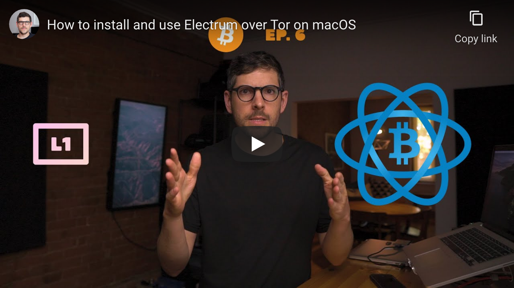

<!--
Title: How to install and use Electrum over Tor on macOS
Description: Learn how to install and use Electrum over Tor on macOS.
Author: Sun Knudsen <https://github.com/sunknudsen>
Contributors: Sun Knudsen <https://github.com/sunknudsen>
Reviewers:
Publication date: 2021-06-21T11:03:01.566Z
Listed: true
-->

# How to install and use Electrum over Tor on macOS

[](https://www.youtube.com/watch?v=QQsAu-9brYY "How to install and use Electrum over Tor on macOS")

## Requirements

- Computer running macOS Catalina or Big Sur

## Caveats

- When copy/pasting commands that start with `$`, strip out `$` as this character is not part of the command
- Press <kbd>ctrl+c</kbd> to stop running command before closing Terminal

## Setup guide

### Step 1: install [Homebrew](https://brew.sh/)

```console
$ /bin/bash -c "$(curl -fsSL https://raw.githubusercontent.com/Homebrew/install/master/install.sh)"

$ uname -m | grep arm64 && echo 'export PATH=$PATH:/opt/homebrew/bin' >> ~/.zshrc && source ~/.zshrc
```

### Step 2: disable Homebrew analytics

```shell
brew analytics off
```

### Step 3: install [GnuPG](https://gnupg.org/)

```shell
brew install gnupg
```

### Step 4: install [Electrum](https://electrum.org/#home)

#### Import ThomasV’s PGP public key

```console
$ curl https://raw.githubusercontent.com/spesmilo/electrum/master/pubkeys/ThomasV.asc | gpg --import
  % Total    % Received % Xferd  Average Speed   Time    Time     Time  Current
                                 Dload  Upload   Total   Spent    Left  Speed
100  4739  100  4739    0     0   1039      0  0:00:04  0:00:04 --:--:--  1039
gpg: key 0x2BD5824B7F9470E6: public key "Thomas Voegtlin (https://electrum.org) <thomasv@electrum.org>" imported
gpg: Total number processed: 1
gpg:               imported: 1
```

imported: 1

👍

#### Download Electrum release

Go to https://electrum.org/#download and download latest release and associated PGP signature to `~/Downloads` folder.

#### Verify Electrum release (learn how [here](../how-to-verify-pgp-digital-signatures-using-gnupg-on-macos))

> Heads-up: replace `4.1.4` with [latest release](https://electrum.org/#download) semver.

```console
$ gpg --verify ~/Downloads/electrum-4.1.4.dmg.ThomasV.asc ~/Downloads/electrum-4.1.4.dmg
gpg: Signature made Thu 17 Jun 08:57:16 2021 EDT
gpg:                using RSA key 6694D8DE7BE8EE5631BED9502BD5824B7F9470E6
gpg: Good signature from "Thomas Voegtlin (https://electrum.org) <thomasv@electrum.org>" [unknown]
gpg:                 aka "ThomasV <thomasv1@gmx.de>" [unknown]
gpg:                 aka "Thomas Voegtlin <thomasv1@gmx.de>" [unknown]
gpg: WARNING: This key is not certified with a trusted signature!
gpg:          There is no indication that the signature belongs to the owner.
Primary key fingerprint: 6694 D8DE 7BE8 EE56 31BE  D950 2BD5 824B 7F94 70E6
```

Good signature

👍

#### Install Electrum

Double-click “electrum-4.1.4.dmg” and drag-and-drop “Electrum” into “Applications” folder.

### Step 5: install [Tor Browser](https://www.torproject.org/) (used to connect to Electrum public servers over Tor)

#### Import “Tor Browser Developers (signing key)” PGP public key

```console
$ gpg --keyserver hkps://keys.openpgp.org --recv-keys 0x4E2C6E8793298290
gpg: key 0x4E2C6E8793298290: public key "Tor Browser Developers (signing key) <torbrowser@torproject.org>" imported
gpg: Total number processed: 1
gpg:               imported: 1
```

imported: 1

👍

#### Download “Tor Browser” release

Go to https://www.torproject.org/download/ and download latest release and associated PGP signature to `~/Downloads` folder.

#### Verify “Tor Browser” release (learn how [here](../how-to-verify-pgp-digital-signatures-using-gnupg-on-macos))

> Heads-up: replace `10.0.17` with [latest release](https://www.torproject.org/download/) semver.

```console
$ gpg --verify ~/Downloads/TorBrowser-10.0.17-osx64_en-US.dmg.asc
gpg: assuming signed data in '/Users/sunknudsen/Downloads/TorBrowser-10.0.17-osx64_en-US.dmg'
gpg: Signature made Tue  1 Jun 18:02:44 2021 EDT
gpg:                using RSA key 0xEB774491D9FF06E2
gpg: Good signature from "Tor Browser Developers (signing key) <torbrowser@torproject.org>" [unknown]
gpg: WARNING: This key is not certified with a trusted signature!
gpg:          There is no indication that the signature belongs to the owner.
Primary key fingerprint: EF6E 286D DA85 EA2A 4BA7  DE68 4E2C 6E87 9329 8290
     Subkey fingerprint: 1107 75B5 D101 FB36 BC6C  911B EB77 4491 D9FF 06E2
```

Good signature

👍

#### Install “Tor Browser”

Double-click “TorBrowser-10.0.17-osx64_en-US.dmg” and drag-and-drop “Tor Browser” into “Applications” folder.

---

## Usage guide

### Step 1: start Tor SOCKSv5 proxy

```console
$ /Applications/Tor\ Browser.app/Contents/Resources/TorBrowser/Tor/tor
Jun 21 08:20:47.065 [notice] Tor 0.4.5.8 (git-27e5e33d2ca35de8) running on Darwin with Libevent 2.1.11-stable, OpenSSL 1.1.1k, Zlib 1.2.11, Liblzma N/A, Libzstd N/A and Unknown N/A as libc.
Jun 21 08:20:47.065 [notice] Tor can't help you if you use it wrong! Learn how to be safe at https://www.torproject.org/download/download#warning
Jun 21 08:20:47.065 [notice] Configuration file "/var/tmp/dist/tor/etc/tor/torrc" not present, using reasonable defaults.
Jun 21 08:20:47.067 [notice] Opening Socks listener on 127.0.0.1:9050
Jun 21 08:20:47.067 [notice] Opened Socks listener connection (ready) on 127.0.0.1:9050
Jun 21 08:20:47.000 [notice] Bootstrapped 0% (starting): Starting
Jun 21 08:20:47.000 [notice] Starting with guard context "default"
Jun 21 08:20:48.000 [notice] Bootstrapped 5% (conn): Connecting to a relay
Jun 21 08:20:48.000 [notice] Bootstrapped 10% (conn_done): Connected to a relay
Jun 21 08:20:48.000 [notice] Bootstrapped 14% (handshake): Handshaking with a relay
Jun 21 08:20:49.000 [notice] Bootstrapped 15% (handshake_done): Handshake with a relay done
Jun 21 08:20:49.000 [notice] Bootstrapped 75% (enough_dirinfo): Loaded enough directory info to build circuits
Jun 21 08:20:49.000 [notice] Bootstrapped 90% (ap_handshake_done): Handshake finished with a relay to build circuits
Jun 21 08:20:49.000 [notice] Bootstrapped 95% (circuit_create): Establishing a Tor circuit
Jun 21 08:20:51.000 [notice] Bootstrapped 100% (done): Done
```

Done

👍

### Step 2: start Electrum using Tor SOCKSv5 proxy

> Heads-up: append `--testnet` for Testnet.

```shell
/Applications/Electrum.app/Contents/MacOS/run_electrum --proxy socks5:127.0.0.1:9050
```
