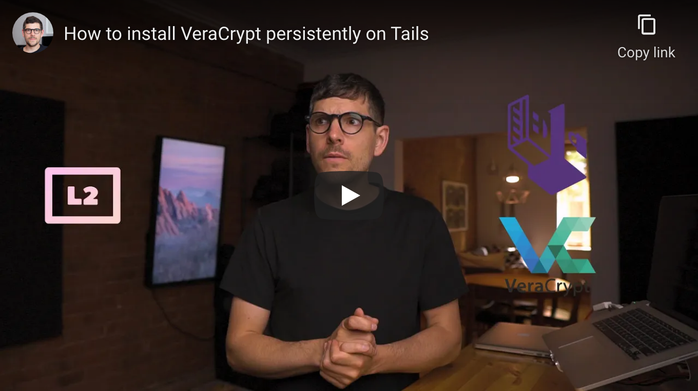

<!--
Title: How to install and use VeraCrypt on Tails
Description: Learn how to install and use VeraCrypt on Tails.
Author: Sun Knudsen <https://github.com/sunknudsen>
Contributors: Sun Knudsen <https://github.com/sunknudsen>
Reviewers:
Publication date: 2021-05-09T12:10:53.922Z
Listed: true
-->

# How to install and use VeraCrypt on Tails

[](https://www.youtube.com/watch?v=ZlWNmpFxk1g "How to install VeraCrypt persistently on Tails")

## Requirements

- [Tails USB flash drive or SD card](../how-to-install-tails-on-usb-flash-drive-or-sd-card-on-macos)

## Caveats

- When copy/pasting commands that start with `$`, strip out `$` as this character is not part of the command

## Setup guide

### Step 1: boot to Tails and set admin password (required to [create optional exFAT partition](#step-2-optional-create-exfat-partition-on-tails-usb-flash-drive-or-sd-card))

> Heads-up: if keyboard layout of computer isn’t “English (US)”, set “Keyboard Layout”.

Click “+” under ”Additional Settings”, then “Administration Password”, set password, click “Add” and finally “Start Tails”.

### Step 2 (optional): create exFAT partition on Tails USB flash drive or SD card

> Heads-up: partition used to move files between Tails and other operating systems such as macOS.

Click “Applications”, then “Utilities”, then “Disks”, select USB flash drive or SD card, click “Free Space”, then “+”, set “Partition Size”, click “Next”, set “Volume Name”, select “Other”, click “Next”, select “exFAT” and finally click “Create”.

### Step 3: enable persistence

Click “Applications”, then “Favorites”, then “Configure persistent volume”, set passphrase, click “Create”, make sure “Personal Data” is enabled, click “Save” and finally “Restart Now”.

### Step 4: boot to Tails, unlock persistent storage and set admin password (required to mount VeraCrypt volumes)

> Heads-up: if keyboard layout of computer isn’t “English (US)”, set “Keyboard Layout”.

Click “+” under ”Additional Settings”, then “Administration Password”, set password, click “Add” and finally “Start Tails”.

### Step 5: establish network connection using ethernet cable or Wi-Fi and wait for Tor to be ready.

Tor is ready

👍

### Step 6: import “VeraCrypt Team (2018 - Supersedes Key ID=0x54DDD393)” PGP public key

```console
$ torsocks curl https://www.idrix.fr/VeraCrypt/VeraCrypt_PGP_public_key.asc | gpg --import
  % Total    % Received % Xferd  Average Speed   Time    Time     Time  Current
                                 Dload  Upload   Total   Spent    Left  Speed
100  5434  100  5434    0     0   3002      0  0:00:01  0:00:01 --:--:--  3000
gpg: key 0x821ACD02680D16DE: 1 signature not checked due to a missing key
gpg: key 0x821ACD02680D16DE: public key "VeraCrypt Team (2018 - Supersedes Key ID=0x54DDD393) <veracrypt@idrix.fr>" imported
gpg: Total number processed: 1
gpg:               imported: 1
gpg: no ultimately trusted keys found
```

imported: 1

👍

### Step 7: download latest release of [VeraCrypt](https://veracrypt.fr/en/Home.html)

Click “Applications”, then “Tor Browser”, go to https://www.veracrypt.fr/en/Downloads.html and download latest release of “Linux Generic Installer” and associated PGP signature.

### Step 8: set VeraCrypt release semver environment variable

> Heads-up: replace `1.24-Update7` with [latest release](https://www.veracrypt.fr/en/Downloads.html) semver.

```shell
VERACRYPT_RELEASE_SEMVER=1.24-Update7
```

### Step 9: verify VeraCrypt release (learn how [here](../how-to-verify-pgp-digital-signatures-using-gnupg-on-macos))

```console
$ gpg --verify ~/Tor\ Browser/veracrypt-$VERACRYPT_RELEASE_SEMVER-setup.tar.bz2.sig
gpg: assuming signed data in '/home/amnesia/Tor Browser/veracrypt-1.24-Update7-setup.tar.bz2'
gpg: Signature made Sat 08 Aug 2020 06:22:10 PM UTC
gpg:                using RSA key 5069A233D55A0EEB174A5FC3821ACD02680D16DE
gpg: Good signature from "VeraCrypt Team (2018 - Supersedes Key ID=0x54DDD393) <veracrypt@idrix.fr>" [unknown]
gpg: WARNING: This key is not certified with a trusted signature!
gpg:          There is no indication that the signature belongs to the owner.
Primary key fingerprint: 5069 A233 D55A 0EEB 174A  5FC3 821A CD02 680D 16DE
```

Good signature

👍

### Step 10: extract VeraCrypt release

```shell
cd ~/Tor\ Browser
tar --extract --file ~/Tor\ Browser/veracrypt-$VERACRYPT_RELEASE_SEMVER-setup.tar.bz2 veracrypt-$VERACRYPT_RELEASE_SEMVER-setup-gui-x64
```

### Step 11: run installer, click “Extract .tar Package File”, accept license terms, click “OK” and finally “OK”.

```shell
./veracrypt-$VERACRYPT_RELEASE_SEMVER-setup-gui-x64
```

### Step 12: extract `veracrypt` binary to ~/Persistent

```shell
cd ~/Persistent
tar --extract --file /tmp/veracrypt_${VERACRYPT_RELEASE_SEMVER}_amd64.tar.gz --strip-components 2 usr/bin/veracrypt
```

### Step 13: create `veracrypt.AppImage`

```shell
echo -n "./veracrypt" > veracrypt.AppImage
chmod +x veracrypt.AppImage
```

👍

---

## Usage guide

To use VeraCrypt, double-click `veracrypt.AppImage`.

👍
