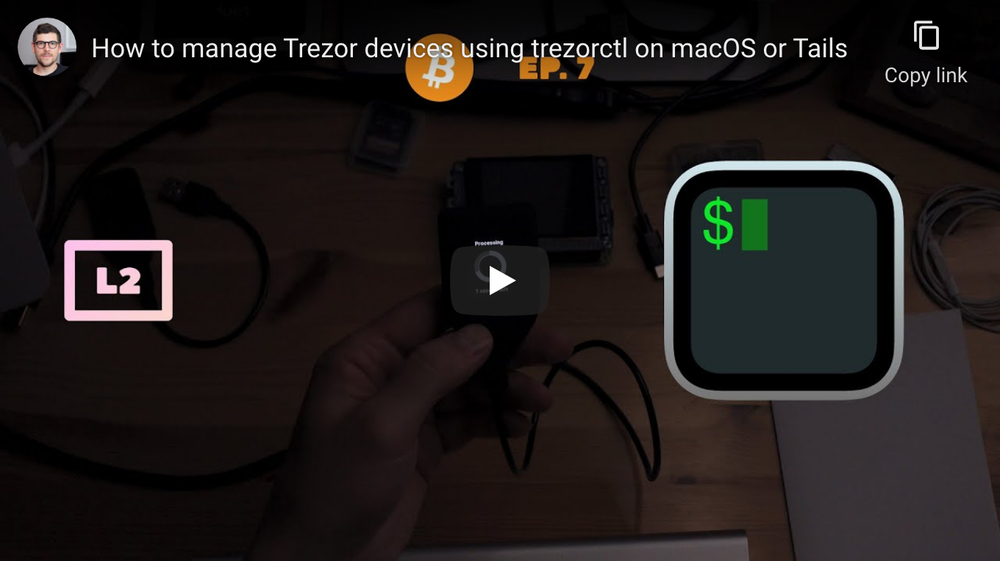

<!--
Title: How to manage Trezor devices using trezorctl on macOS or Tails
Description: Learn how to how to manage Trezor devices using trezorctl on macOS or Tails
Author: Sun Knudsen <https://github.com/sunknudsen>
Contributors: Sun Knudsen <https://github.com/sunknudsen>
Reviewers:
Publication date: 2021-06-26T19:30:49.162Z
Listed: true
-->

# How to manage Trezor devices using trezorctl on macOS or Tails

[](https://www.youtube.com/watch?v=0yWBYL9_uq4 "How to manage Trezor devices using trezorctl on macOS or Tails")

## Requirements

- Computer running macOS Big Sur or Monterey or [Tails USB flash drive or SD card](../how-to-install-tails-on-usb-flash-drive-or-sd-card-on-macos)
- [Trezor](https://trezor.io/) device

## Caveats

- When copy/pasting commands that start with `$`, strip out `$` as this character is not part of the command

## Setup guide (macOS-only)

> Heads-up: [trezorctl](https://wiki.trezor.io/Using_trezorctl_commands_with_Trezor) is pre-installed on [Tails](https://tails.boum.org/) so setup guide can be [skipped](#usage-guide).

### Step 1: install [Homebrew](https://brew.sh/)

```console
$ /bin/bash -c "$(curl -fsSL https://raw.githubusercontent.com/Homebrew/install/master/install.sh)"

$ uname -m | grep arm64 && echo 'export PATH=$PATH:/opt/homebrew/bin' >> ~/.zshrc && source ~/.zshrc
```

### Step 2: disable Homebrew analytics

```shell
brew analytics off
```

### Step 3: install [libusb](https://libusb.info/)

```shell
brew install libusb
```

### Step 4: install [attrs](https://www.attrs.org/en/stable/) and [trezorctl](https://wiki.trezor.io/Using_trezorctl_commands_with_Trezor)

```shell
pip3 install --user attrs trezor
```

### Step 5: source Python 3 `bin` directory

Replace `3.8` with semver of latest version of Python 3 found using `ls $HOME/Library/Python`.

```shell
echo 'export PATH=$PATH:$HOME/Library/Python/3.8/bin' >> ~/.zshrc
source ~/.zshrc
```

👍

---

## Usage guide

### Install or update firmware

> Heads-up: connect device in [bootloader mode](https://wiki.trezor.io/User_manual:Updating_the_Trezor_device_firmware__T1) before running command.

> Heads-up: Trezor devices [ship without firmware](https://wiki.trezor.io/Firmware) so one needs to install firmware before [setting up device](#setup-device).

```console
$ trezorctl firmware-update
Best available version: 1.10.1
Downloading from https://wallet.trezor.io/data/firmware/1/trezor-1.10.1.bin
Trezor One firmware with embedded v2 image (1.8.0 or later)
Firmware version 1.10.1 build 0
Signatures are valid.
Firmware fingerprint: 36400becf1cdddec22b8150d56ff59eef76d37fef60dc465a6f82b4858903886
Embedded v2 image fingerprint: 58738454f7640ddf9fdf462c347bc489a3c6adaacd22225833edbe7fc49704df
Extracting embedded firmware image.
```

### Setup device

Replace `--strength 256` with `--strength 128` for 12-word mnemonic.

```console
$ trezorctl device setup --strength 256 --passphrase-protection --pin-protection --label "My Trezor One" --backup-type single
Please confirm action on your Trezor device.
Use the numeric keypad to describe number positions. The layout is:
    7 8 9
    4 5 6
    1 2 3
Please enter new PIN:
Please enter new PIN again:
Device successfully initialized
```

### Change PIN

```console
$ trezorctl change-pin
Please confirm action on your Trezor device.
Use the numeric keypad to describe number positions. The layout is:
    7 8 9
    4 5 6
    1 2 3
Please enter current PIN:
Please enter new PIN:
Please enter new PIN again:
PIN changed
```

### Set label

```console
$ trezorctl set-label "My Trezor One"
Please confirm action on your Trezor device.
Settings applied
```

### Factory reset device

> Heads-up: connect device in [bootloader mode](https://wiki.trezor.io/User_manual:Updating_the_Trezor_device_firmware__T1) before running command.

```console
$ trezorctl wipe-device --bootloader
Wiping user data and firmware!
Error: trezord: read/48 failed with code 400: device disconnected during action
```
