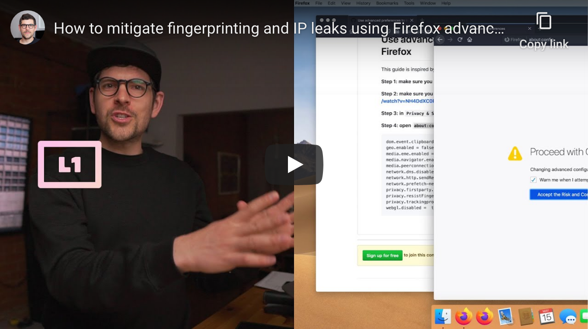

<!--
Title: How to mitigate fingerprinting and IP leaks using Firefox advanced preferences
Description: Learn how to mitigate fingerprinting and IP leaks using Firefox advanced preferences.
Author: Sun Knudsen <https://github.com/sunknudsen>
Contributors: Sun Knudsen <https://github.com/sunknudsen>
Reviewers:
Publication date: 2020-05-15T00:00:00.000Z
Listed: true
-->

# How to mitigate fingerprinting and IP leaks using Firefox advanced preferences

[](https://www.youtube.com/watch?v=uYoJ7U0OMCY "How to mitigate fingerprinting and IP leaks using Firefox advanced preferences")

## Guide

### Step 1: make sure you are running the latest version of Firefox

### Step 2: make sure you configured Firefox for privacy using https://www.youtube.com/watch?v=NH4DdXC0RFw

### Step 3: in `Privacy & Security`, disable `Deceptive Content and Dangerous Software Protection`

### Step 4: open `about:config` and set the following

```
beacon.enabled = false
browser.send_pings = false
dom.battery.enabled = false
dom.event.clipboardevents.enabled = false
geo.enabled = false
media.eme.enabled = false
media.navigator.enabled = false
media.peerconnection.enabled = false
network.dns.disablePrefetch = true
network.http.sendRefererHeader = 0
network.prefetch-next = false
privacy.firstparty.isolate = true
privacy.resistFingerprinting = true
privacy.trackingprotection.enabled = true
webgl.disabled =  true
```

👍
