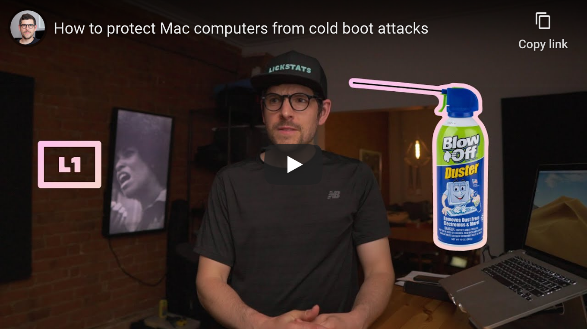

<!--
Title: How to protect Mac computers from cold boot attacks
Description: Learn how to protect Mac computers from cold boot attacks.
Author: Sun Knudsen <https://github.com/sunknudsen>
Contributors: Sun Knudsen <https://github.com/sunknudsen>
Reviewers:
Publication date: 2020-06-05T00:00:00.000Z
Listed: true
-->

# How to protect Mac computers from cold boot attacks

[](https://www.youtube.com/watch?v=d_M18sq0TIQ "How to protect Mac computers from cold boot attacks - YouTube")

## Guide

### Run following command using “Terminal” app.

```shell
sudo pmset -a destroyfvkeyonstandby 1 hibernatemode 25 standbydelaylow 0 standbydelayhigh 0
```

👍

`destroyfvkeyonstandby 1` tells macOS to destroy password when computer goes to standby mode.

`hibernatemode 25` tells macOS to store the content of the RAM to the hard drive and power off the RAM (which clears its data).

`standbydelaylow 0` tells macOS to enable standby mode immediately when battery is low and computer is put to sleep.

`standbydelayhigh 0` tells macOS to enable standby mode immediately when battery is high and computer is put to sleep.

Run `man pmset` using “Terminal” app for more information.

---

## Want things back the way they were before following this guide? No problem!

### Run the following `pmset` command using the Terminal.

```shell
sudo pmset -a destroyfvkeyonstandby 0 hibernatemode 3 standbydelaylow 10800 standbydelayhigh 86400
```

👍
