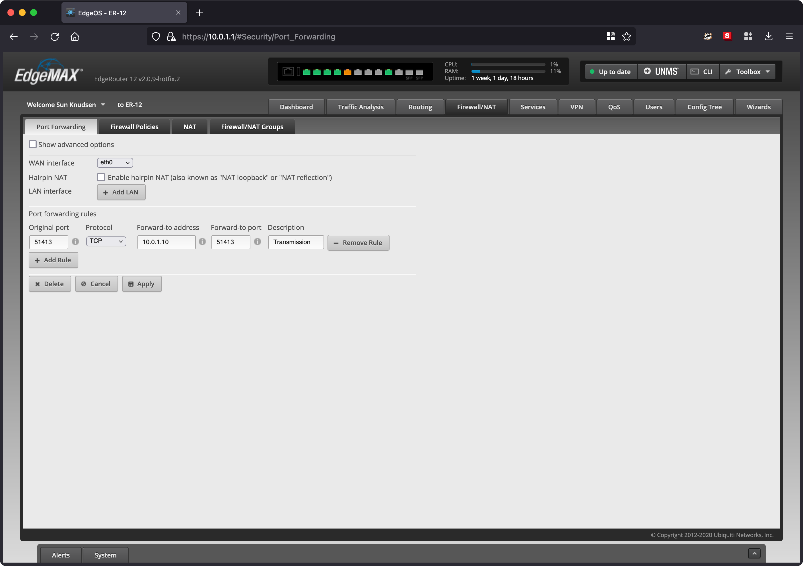
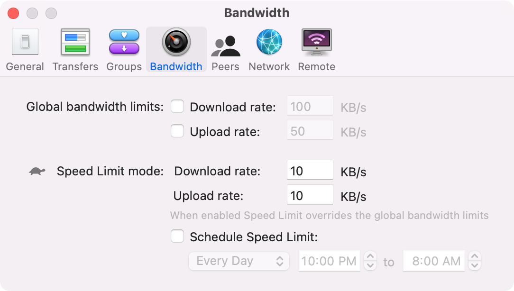
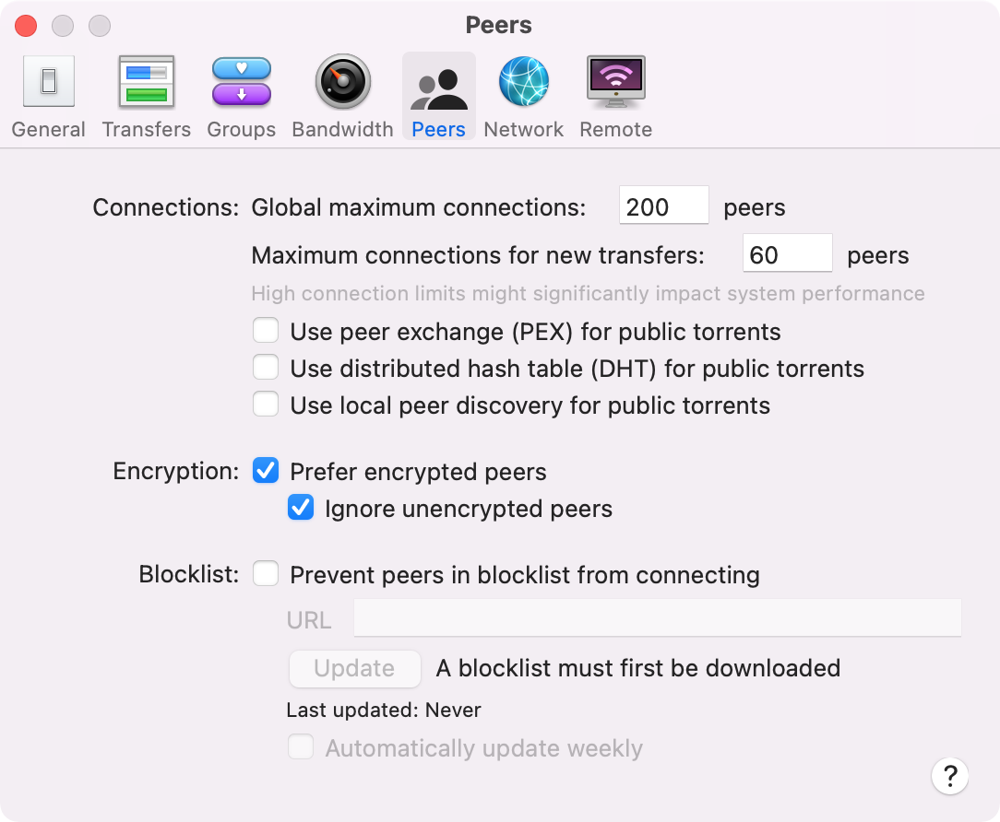
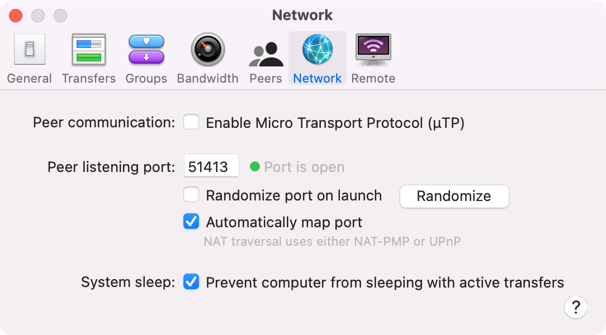

<!--
Title: How to seed bitcoin-dataset on desktop
Description: Learn how to seed bitcoin-dataset on desktop.
Author: Sun Knudsen <https://github.com/sunknudsen>
Contributors: Sun Knudsen <https://github.com/sunknudsen>
Reviewers:
Publication date: 2022-03-01T17:31:42.392Z
Listed: true
-->

# How to seed bitcoin-dataset on desktop

## Requirements

- Linux, macOS or Windows desktop (with at least 500GB of available SSD storage and unlimited bandwidth)
- Transmission app

## Guide

### Step 1: configure port forwarding

> Heads-up: following step forwards inbound TCP requests on port `51413` to desktop (bypassing NAT firewall).

Go to router port forwarding configuration page and forward inbound TCP port `51413` to IP address of desktop and port `51413` (see example below).

### Step 2: install [Transmission](https://transmissionbt.com/)

Go to https://transmissionbt.com/download/, download and install latest release of Transmission.

### Step 3: configure Transmission

> Heads-up: following configuration is tailored to bitcoin-dataset and may not be suited to other use cases.

#### Bandwidth (optional)

> Heads-up: allocating unlimited bandwidth is preferred.

On “Bandwidth” tab, limit bandwidth using “Global bandwidth limits”.

#### Peers

On “Peers” tab, disable “User peer exchange (PEX) for public torrents” and “Use distributed hash table (DHT) for public torrents” and enable “Prefer encrypted peers” and “Ignore unencrypted peers”.

#### Network

On “Network” tab, disable “Enable Micro Transport Protocol (μTP)” and set “Peer listening port” to “51413”.

If [port forwarding](#step-1-configure-port-forwarding) is properly configured, green dot is displayed alongside “Port is open”.

### Step 4: download (and optionally verify) bitcoin-dataset [torrent](../../bitcoin-dataset.torrent) ([PGP signature](../../bitcoin-dataset.torrent.asc), [PGP public key](https://sunknudsen.com/sunknudsen.asc))

### Step 5: download bitcoin-dataset

Double-click `bitcoin-dataset.torrent`, select “Download to” path and click “Add”.

### Step 6: seed bitcoin-dataset

👍
