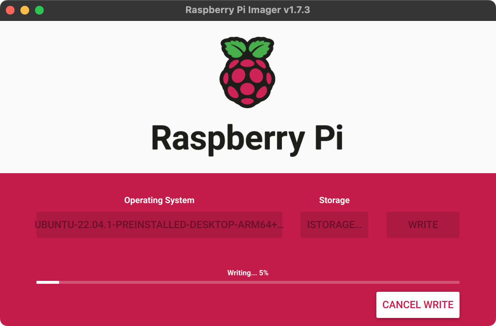
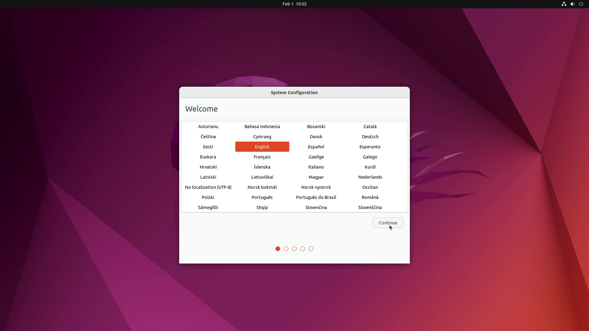
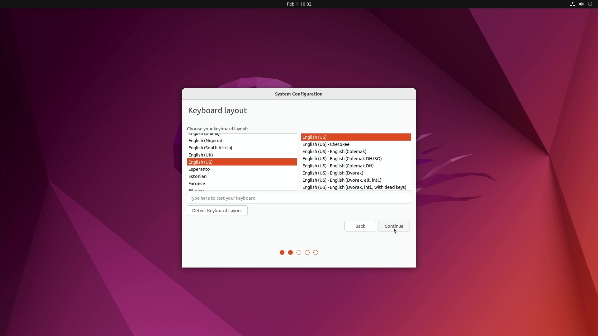
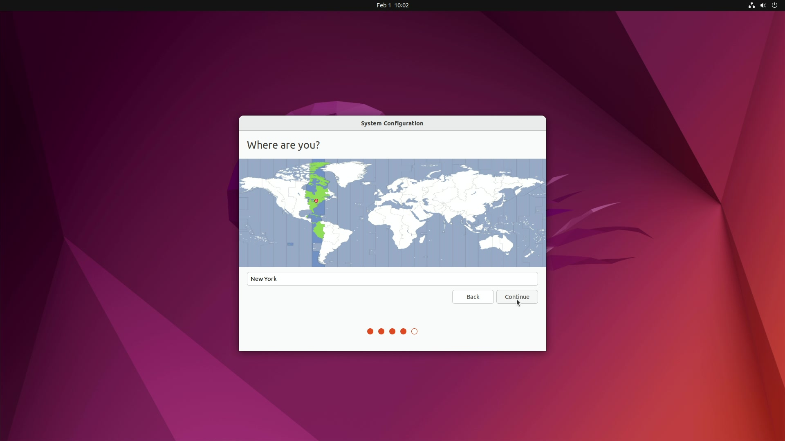
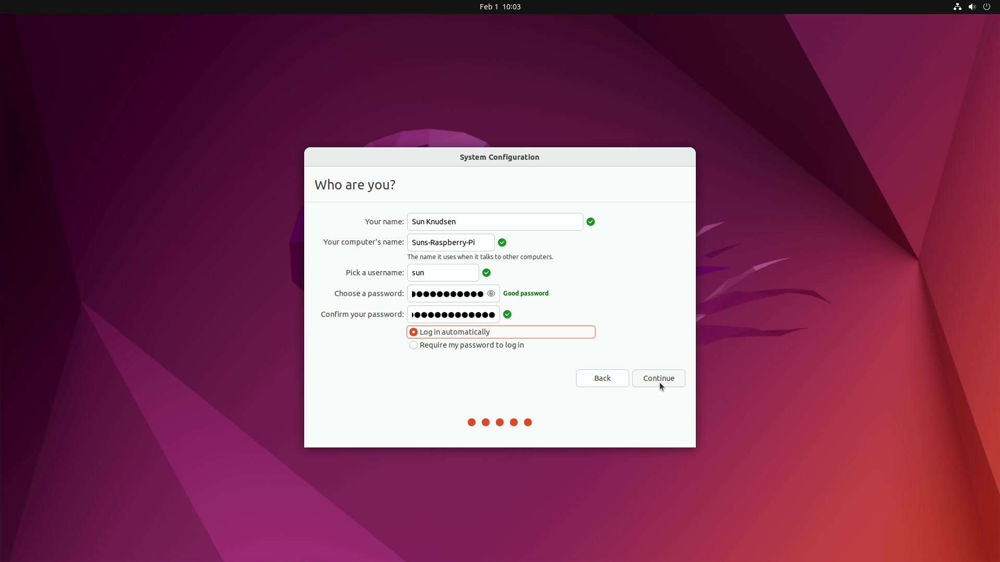
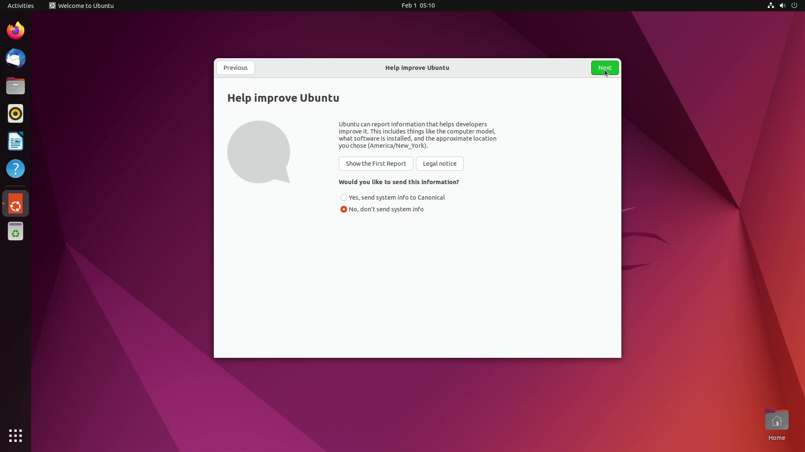
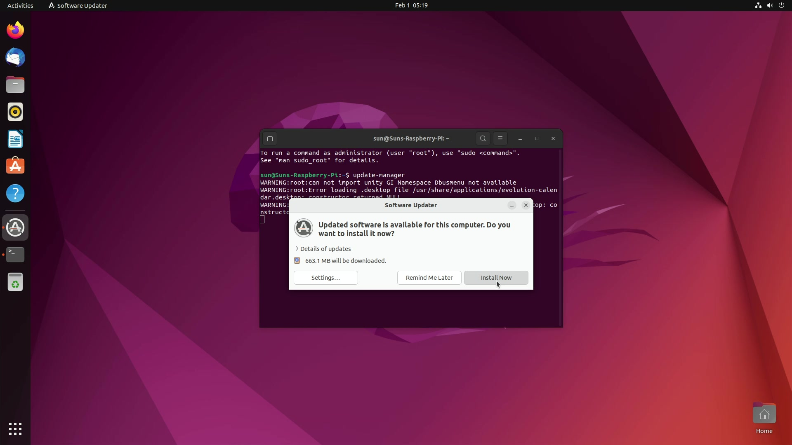
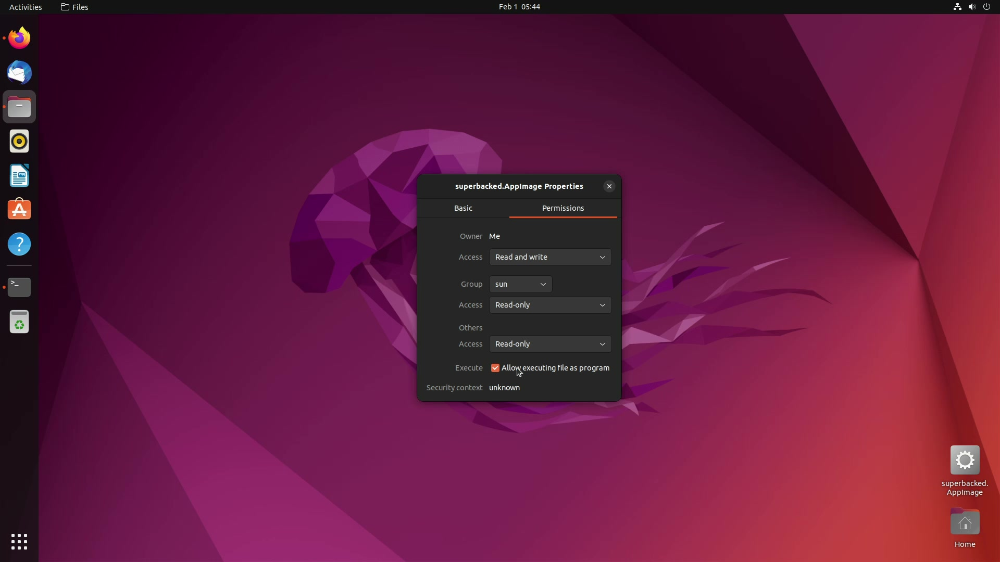

<!--
Title: How to setup hardened Ubuntu environment on Raspberry Pi
Description: Learn how to setup air-gapped and non-persistent Ubuntu environment running on Raspberry Pi.
Author: Sun Knudsen <https://github.com/sunknudsen>
Contributors: Sun Knudsen <https://github.com/sunknudsen>
Reviewers:
Publication date: 2023-02-13T21:05:15.462Z
Listed: true
-->

# How to setup hardened Ubuntu environment on Raspberry Pi

## Requirements

The following hardware is required.

- [Raspberry Pi 4](https://www.raspberrypi.com/products/raspberry-pi-4-model-b/) (2GB min)
- Raspberry Pi [15W USB-C Power Supply](https://www.raspberrypi.com/products/type-c-power-supply/)
- Raspberry Pi [keyboard](https://www.raspberrypi.com/products/raspberry-pi-keyboard-and-hub/) and [mouse](https://www.raspberrypi.com/products/raspberry-pi-mouse/) (or equivalent)
- Raspberry Pi [Micro HDMI to Standard HDMI (A/M) Cable](https://www.raspberrypi.com/products/micro-hdmi-to-standard-hdmi-a-cable/) (or equivalent)
- microSD card or USB flash drive (used to install Ubuntu for desktops, 16GB min)
- HDMI display (720p min)

## Recommendations

Installing Ubuntu for desktops on [datAshur PRO²](https://istorage-uk.com/product/datashur-pro2/) USB flash drive is recommended to enforce access control, data persistence and tamper resistance hardening.

## Bootable installer creation guide

### Step 1: install [Raspberry Pi Imager](https://www.raspberrypi.com/software/)

#### macOS

Go to https://www.raspberrypi.com/software/, download and install Raspberry Pi Imager.

#### Ubuntu (or other Debian-based OS)

> Heads-up: depends on [Qt](https://www.qt.io/).

```shell-session
$ sudo add-apt-repository -y universe

$ sudo apt install -y rpi-imager
```

### Step 2: disable Raspberry Pi Imager [telemetry](https://github.com/raspberrypi/rpi-imager#telemetry)

#### macOS

```shell-session
$ defaults write org.raspberrypi.Imager.plist telemetry -bool NO
```

#### Ubuntu (or other Debian-based OS)

```shell-session
$ mkdir -p ~/.config/Raspberry\ Pi

$ cat << "EOF" > ~/.config/Raspberry\ Pi/Imager.conf
[General]
telemetry=false
EOF
```

### Step 3: download [Ubuntu for desktops](https://ubuntu.com/desktop)

> Heads-up: for additional security, [verify](https://ubuntu.com/tutorials/how-to-verify-ubuntu) Ubuntu for desktops download.

Go to https://ubuntu.com/download/raspberry-pi and download Ubuntu Desktop 22.04.1 LTS.

### Step 4: copy Ubuntu for desktops to USB flash drive

Open “Raspberry Pi Imager”, click “CHOOSE OS”, then “Use custom”, select Ubuntu for desktops `.img.xz`, click “CHOOSE STORAGE”, select USB flash drive and, finally, click “WRITE”.



👍

## Installation guide

### Step 1: choose language and click “Continue”



### Step 2: choose keyboard layout and click “Continue”



### Step 3: choose timezone and click “Continue”



### Step 4: choose credentials, select “Log in automatically” (optional) and click “Continue”



👍

## Configuration guide

### Step 1: disable telemetry



### Step 2: run `update-manager` and click “Install Now”



### Step 3: reboot

### Step 4 (optional): center new windows

```shell-session
$ gsettings set org.gnome.mutter center-new-windows true
```

### Step 5 (optional): enable dark mode

```shell-session
$ gsettings set org.gnome.desktop.interface color-scheme prefer-dark

$ gsettings set org.gnome.desktop.interface gtk-theme Yaru-dark
```

### Step 6: disable auto-mount

```shell-session
$ gsettings set org.gnome.desktop.media-handling automount false
```

### Step 7: add `universe` APT repository

```shell-session
$ sudo add-apt-repository -y universe
```

### Step 8: install `curl`, `libfuse2`, `overlayroot`, `zbar-tools` and `zlib1g-dev`

```shell-session
$ sudo apt install -y curl libfuse2 overlayroot zbar-tools zlib1g-dev
```

### Step 9 (if applicable): download [Superbacked](https://superbacked.com/) and allow executing `superbacked.AppImage` as program

#### Download Superbacked

> Heads-up: replace `ABCDEFGH` with your license code.

> Heads-up: for additional security, [verify](/faq/release-integrity) Superbacked download.

```shell-session
$ curl --fail --location --output ~/Desktop/superbacked.AppImage "https://superbacked.com/api/downloads/superbacked-std-arm64-latest.AppImage?license=ABCDEFGH"
```

#### Allow executing `superbacked.AppImage` as program

Right-click “superbacked.AppImage”, click “Properties”, click “Permissions” and, finally, select “Allow executing file as program”.



### Step 10: disable Bluetooth and Wi-Fi

```shell-session
$ cat << "EOF" | sudo tee -a /boot/firmware/config.txt
dtoverlay=disable-bt
dtoverlay=disable-wifi
EOF
```

### Step 11: set `ext4` and `vfat` filesystems to read-only

```shell-session
$ sudo sed -i 's/discard,x-systemd.growfs/discard,noload,ro/g' /etc/fstab

$ sudo sed -i 's/defaults/defaults,ro/g' /etc/fstab
```

### Step 12: disable `fsck.repair`

```shell-session
$ sudo sed -i 's/splash/splash fsck.repair=no/g' /boot/firmware/cmdline.txt
```

### Step 13: set `overlayroot` to `tmpfs`

```shell-session
$ sudo sed -i 's/overlayroot=""/overlayroot="tmpfs"/g' /etc/overlayroot.conf
```

### Step 14: clear Bash history

```shell-session
$ history -cw
```

### Step 15: reboot

> Heads-up: filesystem will be mounted as read-only following reboot.

```shell-session
$ sudo systemctl reboot
```

### Step 16: shutdown

> Heads-up: filesystem is ready for optional hardware read-only hardening.

```shell-session
$ sudo systemctl poweroff
```

### Step 17 (optional): enable datAshur PRO² global read-only (see product [documentation](https://istorage-uk.com/product-documentation/) for instructions)

👍
