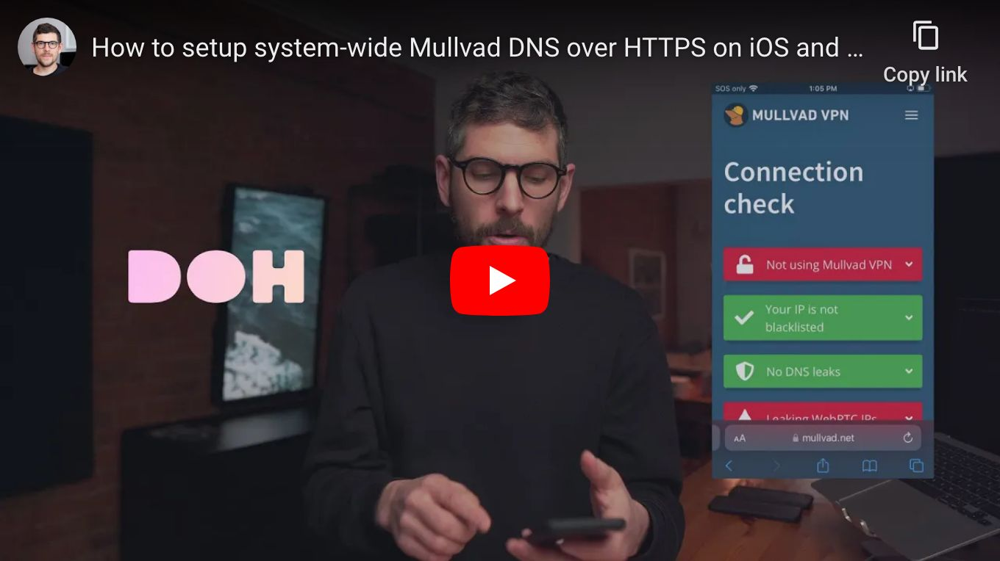

<!--
Title: How to setup system-wide Mullvad DNS over HTTPS on iOS and macOS
Description: Learn how to setup system-wide Mullvad DNS over HTTPS on iOS and macOS.
Author: Sun Knudsen <https://github.com/sunknudsen>
Contributors: Sun Knudsen <https://github.com/sunknudsen>
Reviewers:
Publication date: 2023-02-22T11:26:55.652Z
Listed: true
-->

# How to setup system-wide [Mullvad DNS over HTTPS](https://mullvad.net/en/help/dns-over-https-and-dns-over-tls/) on iOS and macOS

## Requirements

- iPhone running iOS 14 and up
- Mac running Big Sur and up

## iOS guide

> Heads-up: some apps bypass system-wide Mullvad DNS over HTTPS, see https://github.com/paulmillr/encrypted-dns.

### Step 1 (if applicable): disable [Lockdown Mode](https://support.apple.com/en-us/HT212650)

### Step 2: open “Safari” and download [mullvad-doh.mobileconfig](./mullvad-doh.mobileconfig) configuration profile

### Step 3: install “mullvad-doh.mobileconfig” configuration profile

Open “Settings”, click “Profile Downloaded” and, finally, click “Install”

### Step 4 (if applicable): enable Lockdown Mode

### Step 5: check for DNS leaks

Go to [https://mullvad.net/en/check](https://mullvad.net/en/check).

👍

---

## macOS guide

> Heads-up: some apps bypass system-wide Mullvad DNS over HTTPS, see [https://github.com/paulmillr/encrypted-dns](https://github.com/paulmillr/encrypted-dns).

> Heads-up: when using [Little Snitch](https://www.obdev.at/products/littlesnitch/index.html) or [Lulu](https://objective-see.org/products/lulu.html), system-wide Mullvad DNS over HTTPS is disabled given a single network filter can be enabled at a time (restriction imposed by iOS/macOS).

> Heads-up: given above, one should [configure](../how-to-configure-firefox-for-privacy-and-security) Firefox to use DNS over HTTPS as a failsafe.

> Heads-up: for sensitive use cases, use [Tor](https://www.torproject.org/).

### Step 1 (if applicable): disable [Lockdown Mode](https://support.apple.com/en-us/HT212650)

### Step 2: download [mullvad-doh.mobileconfig](./mullvad-doh.mobileconfig) configuration profile

### Step 3: install “mullvad-doh.mobileconfig” configuration profile

Open “System Settings”, search for “Profiles”, click “Profiles”, click “+”, open “mullvad-doh.mobileconfig”, click “Continue” and, finally, click “Install”.

### Step 4 (if applicable): enable Lockdown Mode

### Step 5: check for DNS leaks

Go to [https://mullvad.net/en/check](https://mullvad.net/en/check).

👍

---

## Want things back the way they were before following this guide? No problem!

### Delete configuration profile.

👍
