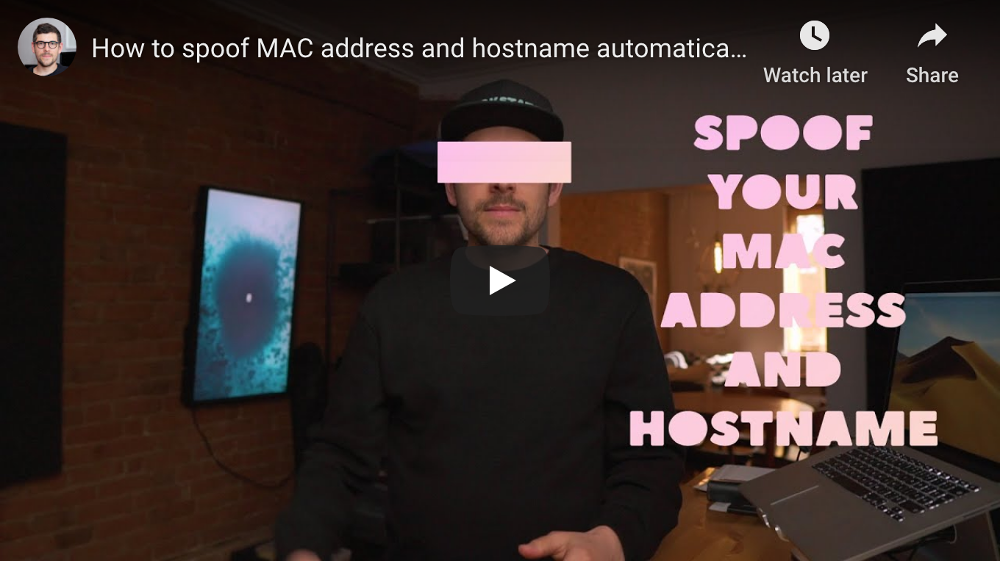

<!--
Title: How to spoof MAC address and hostname automatically at boot on macOS
Description: Learn how to spoof MAC address and hostname automatically at boot on macOS.
Author: Sun Knudsen <https://github.com/sunknudsen>
Contributors: Sun Knudsen <https://github.com/sunknudsen>
Reviewers:
Publication date: 2020-05-19T00:00:00.000Z
Listed: true
-->

# How to spoof MAC address and hostname automatically at boot on macOS

[](https://www.youtube.com/watch?v=ASXANpr_zX8 "How to spoof MAC address and hostname automatically at boot on macOS")

> Heads-up: unfortunately this guide doesn’t work on Macs equipped with T2 chips running macOS Mojave. If that’s your case, consider upgrading to Catalina.

> Heads-up: unfortunately this guide doesn’t work on Macs equipped with M1 processors (see [issue](https://github.com/sunknudsen/privacy-guides/issues/15)).

## Caveats

- When copy/pasting commands that start with `$`, strip out `$` as this character is not part of the command
- When copy/pasting commands that start with `cat << "EOF"`, select all lines at once (from `cat << "EOF"` to `EOF` inclusively) as they are part of the same (single) command

## Guide

### Step 1: create `/usr/local/sbin` folder

```shell
sudo mkdir -p /usr/local/sbin
sudo chown ${USER}:admin /usr/local/sbin
```

### Step 2: source `/usr/local/sbin` folder

Find which shell is configured using `echo $SHELL`.

#### Bash (/bin/bash)

```shell
cat << "EOF" >> ~/.bash_profile
export PATH=${PATH}:/usr/local/sbin
EOF
source ~/.bash_profile
```

#### Z Shell (/bin/zsh)

```shell
cat << "EOF" >> ~/.zshrc
export PATH=${PATH}:/usr/local/sbin
EOF
source ~/.zshrc
```

### Step 3: create `spoof.sh` script

```shell
cat << "EOF" > /usr/local/sbin/spoof.sh
#! /bin/sh

set -e

export LC_CTYPE=C

basedir=$(dirname "$0")

# Spoof computer name
first_name=$(sed "$(jot -r 1 1 2048)q;d" $basedir/first-names.txt | sed -e 's/[^a-zA-Z]//g')
model_name=$(system_profiler SPHardwareDataType | awk '/Model Name/ {$1=$2=""; print $0}' | sed -e 's/^[ ]*//')
computer_name="$first_name’s $model_name"
host_name=$(echo $computer_name | sed -e 's/’//g' | sed -e 's/ /-/g')
sudo scutil --set ComputerName "$computer_name"
sudo scutil --set LocalHostName "$host_name"
sudo scutil --set HostName "$host_name"
printf "%s\n" "Spoofed hostname to $host_name"

# Spoof MAC address of en0 interface
mac_address_prefix=$(sed "$(jot -r 1 1 768)q;d" $basedir/mac-address-prefixes.txt | sed -e 's/[^A-F0-9:]//g')
mac_address_suffix=$(openssl rand -hex 3 | sed 's/\(..\)/\1:/g; s/.$//')
mac_address=$(echo "$mac_address_prefix:$mac_address_suffix" | awk '{print toupper($0)}')
sudo ifconfig en0 ether "$mac_address"
printf "%s\n" "Spoofed MAC address of en0 interface to $mac_address"
EOF
```

### Step 4: make `spoof.sh` executable

```shell
chmod +x /usr/local/sbin/spoof.sh
```

### Step 5: download [first-names.txt](./first-names.txt)

This list includes the top 2048 most popular baby names from the [USA Social Security Administration](https://www.ssa.gov/oact/babynames/limits.html).

```shell
curl -o /usr/local/sbin/first-names.txt https://sunknudsen.com/static/media/privacy-guides/how-to-spoof-mac-address-and-hostname-automatically-at-boot-on-macos/first-names.txt
```

### Step 6: download [mac-address-prefixes.txt](./mac-address-prefixes.txt)

This list includes 768 Apple MAC address prefixes.

```shell
curl -o /usr/local/sbin/mac-address-prefixes.txt https://sunknudsen.com/static/media/privacy-guides/how-to-spoof-mac-address-and-hostname-automatically-at-boot-on-macos/mac-address-prefixes.txt
```

### Step 7: create `local.spoof.plist` launch daemon

This step is responsible for running `spoof.sh` every time your Mac boots.

```shell
cat << "EOF" | sudo tee /Library/LaunchDaemons/local.spoof.plist
<?xml version="1.0" encoding="UTF-8"?>
<!DOCTYPE plist PUBLIC "-//Apple//DTD PLIST 1.0//EN" "http://www.apple.com/DTDs/PropertyList-1.0.dtd">
<plist version="1.0">
  <dict>
    <key>Label</key>
    <string>spoof</string>

    <key>ProgramArguments</key>
    <array>
        <string>/usr/local/sbin/spoof.sh</string>
    </array>

    <key>RunAtLoad</key>
    <true/>
  </dict>
</plist>
EOF
```

### Step 8: reboot and confirm hostname and MAC address have been spoofed

```console
# Spoofed hostname
$ scutil --get HostName
Gatlins-MacBook-Pro

# Spoofed MAC address
$ ifconfig en0 | grep ether | awk '{print $2}'
20:ee:28:31:03:f6

# Hardware MAC address
$ networksetup -listallhardwareports | awk -v RS= '/en0/{print $NF}'
9c:f4:8e:d6:2b:7d
```

“Spoofed hostname” is random and “Spoofed MAC address” doesn’t match “Hardware MAC address”?

👍

---

## Want things back the way they were before following this guide? No problem!

### Step 1: set computer name, local hostname and hostname

Replace `John` with a name to your liking.

```shell
sudo scutil --set ComputerName "John’s MacBook Pro"
sudo scutil --set LocalHostName "Johns-MacBook-Pro"
sudo scutil --set HostName "Johns-MacBook-Pro"
```

### Step 2: set MAC address to default value

Given MAC address spoofing is ephemeral, deleting the `/Library/LaunchDaemons/local.spoof.plist` launch daemon and rebooting will reset your MAC address to its default value.

```shell
sudo rm /Library/LaunchDaemons/local.spoof.plist
```

### Step 3: delete script and datasets

```shell
rm /usr/local/sbin/spoof.sh
rm /usr/local/sbin/first-names.txt
rm /usr/local/sbin/mac-address-prefixes.txt
```

👍
