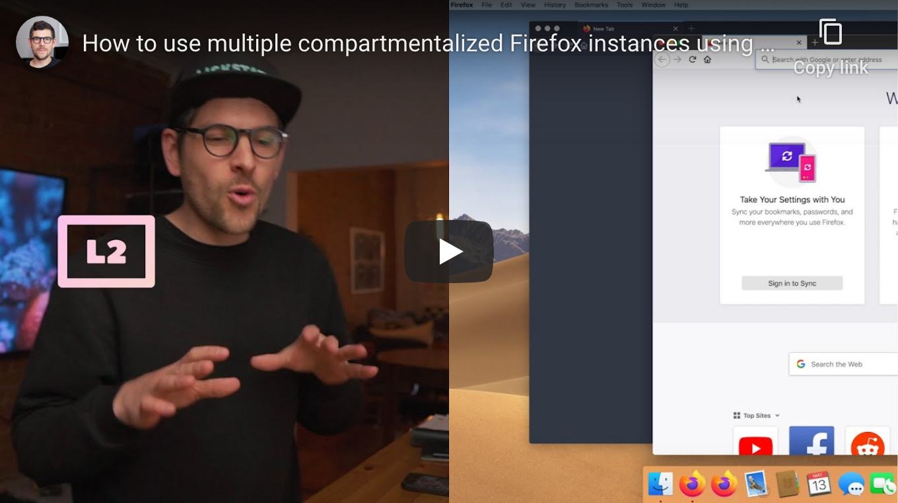

<!--
Title: How to use multiple compartmentalized Firefox instances simultaneously using profiles
Description: Learn how to use multiple compartmentalized Firefox instances simultaneously using profiles.
Author: Sun Knudsen <https://github.com/sunknudsen>
Contributors: Sun Knudsen <https://github.com/sunknudsen>
Reviewers:
Publication date: 2020-05-13T00:00:00.000Z
Listed: true
-->

# How to use multiple compartmentalized Firefox instances simultaneously using profiles

[](https://www.youtube.com/watch?v=Upib_vq_EB8 "How to use multiple compartmentalized Firefox instances using profiles - YouTube")

### Step 1: create Firefox profile

```shell
/Applications/Firefox.app/Contents/MacOS/firefox-bin -p
```

### Step 2: open Firefox profile

> Heads-up: in the following command, make sure you replace `work` by the name of your profile. If the name includes spaces, please use quotes (example: `-p "Work Profile"`).

```shell
nohup /Applications/Firefox.app/Contents/MacOS/firefox-bin -p work --no-remote > /dev/null 2>&1 &
```

👍
