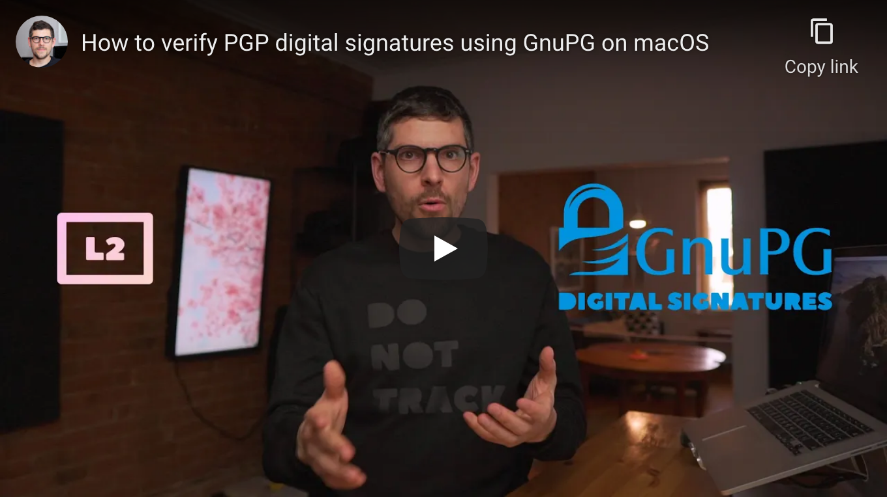

<!--
Title: How to verify PGP digital signatures using GnuPG on macOS
Description: Learn how to verify PGP digital signatures using GnuPG on macOS.
Author: Sun Knudsen <https://github.com/sunknudsen>
Contributors: Sun Knudsen <https://github.com/sunknudsen>
Reviewers:
Publication date: 2021-03-24T12:40:31.074Z
Listed: true
-->

# How to verify PGP digital signatures using GnuPG on macOS

[](https://www.youtube.com/watch?v=WnNfunEJdQY "How to verify PGP digital signatures using GnuPG on macOS")

## Caveats

- When copy/pasting commands that start with `$`, strip out `$` as this character is not part of the command

## Setup guide

### Step 1: install [Homebrew](https://brew.sh/)

```shell
/bin/bash -c "$(curl -fsSL https://raw.githubusercontent.com/Homebrew/install/master/install.sh)"
```

### Step 2: disable Homebrew analytics

```shell
brew analytics off
```

### Step 3: install [GnuPG](https://gnupg.org/)

```shell
brew install gnupg
```

👍

---

## Usage guide

### Import signer’s public key using key server…

> Heads-up: replace `0xC1323A377DE14C8B` with signer’s public key ID.

```console
$ gpg --keyserver hkps://keys.openpgp.org --recv-keys 0xC1323A377DE14C8B
gpg: key 0xC1323A377DE14C8B: public key "Sun Knudsen <hello@sunknudsen.com>" imported
gpg: Total number processed: 1
gpg:               imported: 1
```

imported: 1

👍

### …or using public key URL

> Heads-up: replace `https://sunknudsen.com/sunknudsen.asc` with signer’s public key URL.

```console
$ curl https://sunknudsen.com/sunknudsen.asc | gpg --import
  % Total    % Received % Xferd  Average Speed   Time    Time     Time  Current
                                 Dload  Upload   Total   Spent    Left  Speed
100  6896  100  6896    0     0  11589      0 --:--:-- --:--:-- --:--:-- 11570
gpg: key 0xC1323A377DE14C8B: public key "Sun Knudsen <hello@sunknudsen.com>" imported
gpg: Total number processed: 1
gpg:               imported: 1
```

imported: 1

👍

### Verify signer’s public key using fingerprint

> Heads-up: replace `hello@sunknudsen.com` with signer’s email and use published fingerprints or web of trust to verify signer’s fingerprint (see [example](../how-to-encrypt-sign-and-decrypt-messages-using-gnupg-on-macos#verify-suns-pgp-public-key-using-its-fingerprint)).

```console
$ gpg --fingerprint hello@sunknudsen.com
gpg: checking the trustdb
gpg: marginals needed: 3  completes needed: 1  trust model: pgp
gpg: depth: 0  valid:   1  signed:   0  trust: 0-, 0q, 0n, 0m, 0f, 1u
pub   rsa4096 2019-10-17 [C]
      C4FB DDC1 6A26 2672 920D  0A0F C132 3A37 7DE1 4C8B
uid           [ unknown] Sun Knudsen <hello@sunknudsen.com>
sub   rsa4096 2019-10-17 [E] [expires: 2021-10-25]
sub   rsa4096 2019-10-17 [A] [expires: 2021-10-25]
sub   rsa4096 2019-10-17 [S] [expires: 2021-10-25]
```

### Verify [signed message](https://sunknudsen.com/static/media/cms/donate/donate-bitcoin.asc)

```console
$ gpg --verify donate-bitcoin.asc
gpg: Signature made Sun  7 Mar 14:58:01 2021 EST
gpg:                using RSA key A98CCD122243655B26FAFB611FA767862BBD1305
gpg: Good signature from "Sun Knudsen <hello@sunknudsen.com>" [unknown]
gpg: WARNING: This key is not certified with a trusted signature!
gpg:          There is no indication that the signature belongs to the owner.
Primary key fingerprint: C4FB DDC1 6A26 2672 920D  0A0F C132 3A37 7DE1 4C8B
     Subkey fingerprint: A98C CD12 2243 655B 26FA  FB61 1FA7 6786 2BBD 1305
```

Good signature

👍

### Verify signed [file](https://sunknudsen.com/static/media/privacy-guides/how-to-clean-uninstall-macos-apps-using-appcleaner-open-source-alternative/app-cleaner.sh) using [detached signature](https://sunknudsen.com/static/media/privacy-guides/how-to-clean-uninstall-macos-apps-using-appcleaner-open-source-alternative/app-cleaner.sh.sig)

```console
$ gpg --verify app-cleaner.sh.sig
gpg: assuming signed data in 'app-cleaner.sh'
gpg: Signature made Wed 17 Mar 09:57:42 2021 EDT
gpg:                using RSA key A98CCD122243655B26FAFB611FA767862BBD1305
gpg: Good signature from "Sun Knudsen <hello@sunknudsen.com>" [unknown]
gpg: WARNING: This key is not certified with a trusted signature!
gpg:          There is no indication that the signature belongs to the owner.
Primary key fingerprint: C4FB DDC1 6A26 2672 920D  0A0F C132 3A37 7DE1 4C8B
     Subkey fingerprint: A98C CD12 2243 655B 26FA  FB61 1FA7 6786 2BBD 1305
```

Good signature

👍
